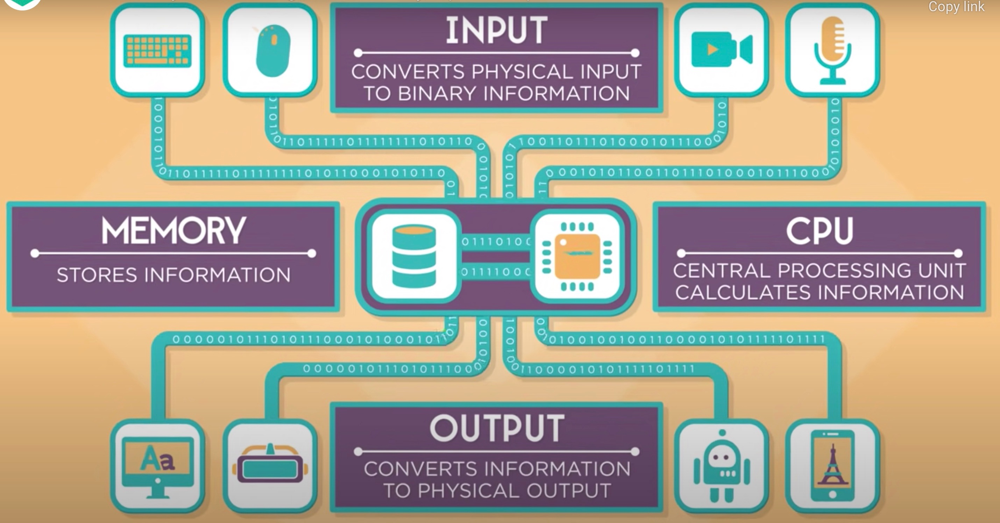

# How do we communicate with computers
Communication with a computer involves 4 components that work togeather to provide you with a result, such sending emails, playing games and writing to a document.

Here are the 4 components:

- Input:  Converts physical input to binary information.
- Memory: Stores information
- CPU: Center Processing Unit calculates information.
- Ouput: Converts information to physical output.

Let's see how the four componets work togeather

## Example
- Computers can take many different types of inputs, such as a keyboard, touch pad of a laptop, power button, cameras, microphone, GPS (Global Positional Systems), touch pad of a phone, sensors on a car, thermostat, or a drone.
- When a key is pressed on a keyboard, let's say the letter B, then the keyboard converts the letter B into a number.
- That number is sent as binary, ones and zeros, into a computer.
- Then the CPU calculcates how to display the 'B' pixel by pixel. 
- The CPU requests step by step instructions from memory on how draw the letter B.
- CPU execute these instructions and stores the results into memory.
- Finally the pixel information is sent in binary to the screen.
- The screen is a output device, like a computer monitor,converts the binary data into the tiny lights and colors that you see on a screen.

Now we know how computers works, like talk about tools that we can use to process your inputs that produces a desire output.

## Programs
A program (or software program) is commonly defined as a set of instructions, or a set of modules or procedures, that allow for a certain type of computer operation. The term is also often used interchangeably with terms like “software application” and “software product.”

Here are some examples of a program:
1. A command console
2. We can use third party software like RemoteDesktop or Putty which are used to connect to different computer than yours.

Let's look at command consoles

### Command Consoles

A command console is pre-installed application that can be run on your computer to execute commands.

A command consoles are used perform specific tasks based on the command you provid.

What are command consoles used for?

Command consoles are used for:
- Creating or changing files or folders.
- Gathering information about your computer such as OS info, gathering network information such as IP address or find out which Wifi your connected.
- Identify what connections are currently running on your machine.
- Running other programs
- Applying software updates.

Command console process data just any other program or actvity such pressing a keyboard:
- The command console takes input from a user.
- The data from the input is stored in memory and then processed by CPU
- Once cpu process is complete, the data is sent to the output for xthe end user to see the results.

This is a picture of a command window.

Here's how you can execute a command using the command console:
- Click on the console screen.
- Type in your command
- Hit the enter key
- Oberserved the results.
### Provided below are some comman commands that can execute using the command console.

| Commands | Description | Example |
|----------|-------------|---------|
| **cls** | This command wipes the command screen clean | cls |
| **Systeminfo** | This command give you a detailed configuration overview for your computer. | systeminfo |
| **tasklist** | This command provdes a current list of all tasks running on your PC. | tasklist |
| **title** | This command chnage the title of the command prompt window. | title New Title
| **color** | This command changes the background color of the command prompt window. | color 1 9 |

**Note:**

Here are color codes that you can use with the **color** command
| Background Color Code | Foreground (text) Color Code| Example |
|-----------------------|-----------------------------|---------|
| 0 (Black) | 8 (Gray) | color 0 8 |
| 1 (Blue) | 9 (Light Blue) | color 1 9 |
| 2 (Green) | A (Light Green)| color 2 A |
| 3 (Aqua) | B (Light Aqua)| color 3 B |
| 4 (Red) | C (Light Red)| color 4 C |
| 5 (Purple) | D (Light Purple)| color 5 D |
| 6 (Yellow) | E (Light Yellow)| color 6 E |
| 7 (White) | F (Bright White)| color 7 F |

## Lets Recap
- A computer processes information using 4 components togeather to produce an output. The components are Input, Memory, CPU and Output.
    - Inputs converts physical input to binary information. An example of an input are keybaords, cameras, drones or even a touch pad on a laptop.
    - Memory: Stores information
    - CPU: Center Processing Unit calculates information.
    - Ouput: Converts information to physical output.
- A program (or software program) is defined as a `set of instructions, or a set of modules or procedures, that allow for a certain type of computer operation`.
    - An example of program is a Command console.
- A Command consoles is a pre-installed application that you can use to execute tasks on a computers.
    -  Common commands that you can perform using a command console are:  
        - Manage files and folders
        - Run other programs
        - Gather information about your computer. 

Next we're going to look at programming languages. Programming languages are used to build programs, create mobile apps and websites. A programming language are the `set of instructions or modules or procedures that allow for a certain type of computer operation`. 

### Let's take a 10 minute break to stretch, go to the bathroom or to get something to each.

[Next up...Programming Languages](https://github.com/brandonmichaelhunter/UMASAV/blob/beetle/Day1/Programming_Languages.md)
