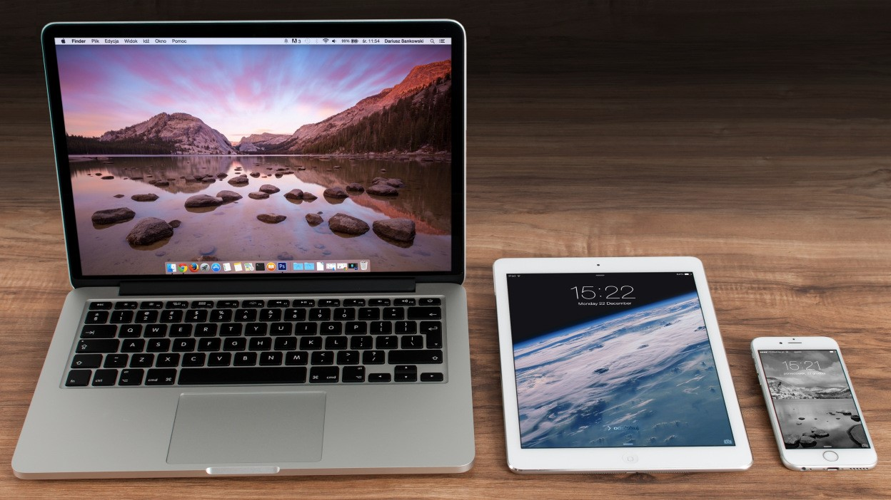
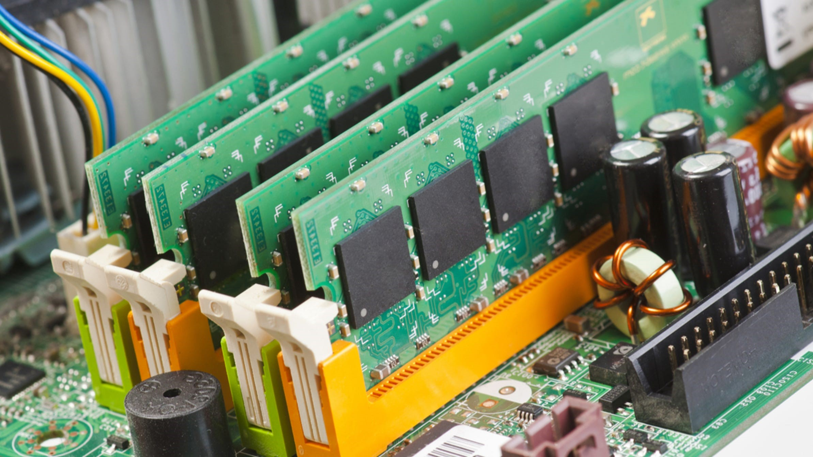
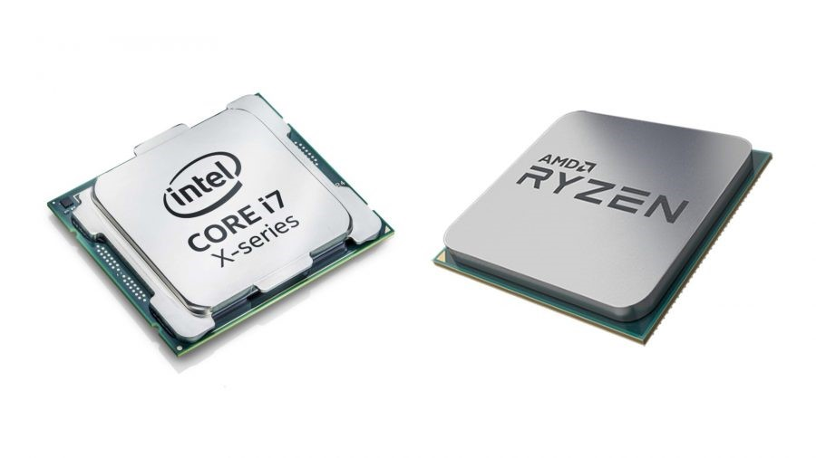
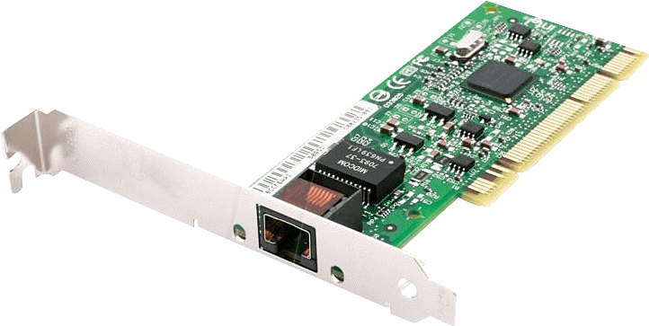
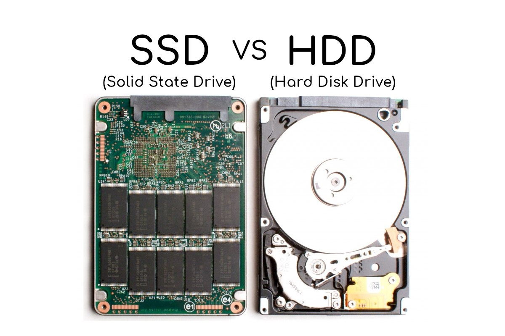
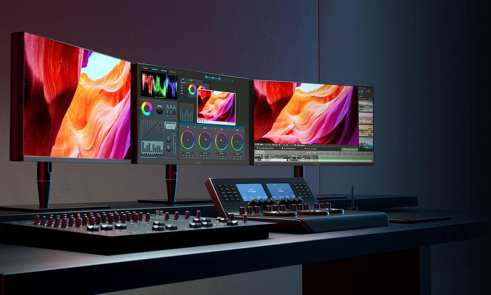
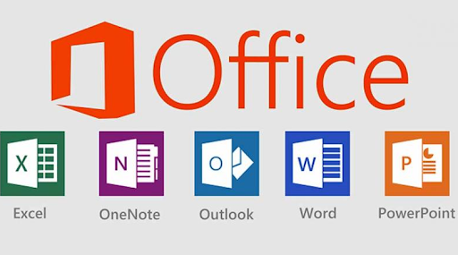
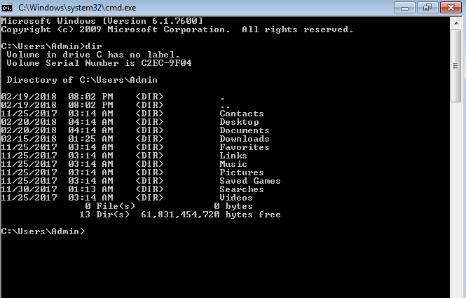

# What is Computer Science
"Computer Science is the study of computers and computational systems. Unlike electrical and computer engineers, computer scientists deal mostly with software and software systems; this includes their theory, design, development, and application.

Principal areas of study within Computer Science include artificial intelligence(facial recognition, perdictions), computer systems and networks (internet & communication), security (Cyber Security), database systems, human computer interaction (Siri), vision and graphics (games), numerical analysis, **programming languages**, **software engineering**, bioinformatics and theory of computing." (Dept of Computer Science at University of Marlyand) 

In this course we will briefly talk about computers, ways we can communicate with computers, what is software\programs and how we can use programming languages to create software\programs\apps and cover briefly some software engineering topics along the way. 

Let's talk about Computers

## What are computers?

- A computer is an electronic device that manipulates information, or data using a combination of hardware and software.
- It has the ability to store, retrieve, and process data. 
- Computers can be to type documents, send email, play games, and browse the Web.
- Computers can be a desktop computer, a laptops, a tablet, a cell phone, a smart watch or a game console like Playstation or Xbox.

Hardware and software are used togeather to provide you with a system where you can save documents, play games, send email and more. 

Let's talk about hardware and software...
## So what is hardware and what is software?

#### **Hardware represents the physical components that are needed to run a computer, such as**:
- **`Memory`**: Used to temporarily store tasks and data used by app(or software\programs). Think of as short term storage for data, documents, images, etc....
- **`CPU (Central Processing Unit)`**: Processes command\tasks given by users and\or software.
- **`Motherboard`**: Its represents the backbone that ties the computer's components together at one spot and allows them to talk to each other.
- **`Graphics Card and Integrated Graphics`**: Processes visual data such as movies, video games.
- **`NIC (Network Interface Card)`**: Provides internet for a computer
- **`Hard Drives (HHD or SSD)`**: Stores files, programs for long term storage.
- **`Monitor`**: Provides a display for your apps\software\programs.

| Memory        | CPU           | Motherboard  | Graphics Cards | NIC | Hard Drives | Monitors |
|:-------------:|:-------------:|:-------------:|:-------------:|:-------------:|:-------------:|:-------------:|
||||||||

#### Software is a set of instructions, data or programs used to operate computers and execute specific tasks. 
Software is made up of source code (or **commands**\instructions), written using a **programming language**, and then compiled into a program for end users to consume.

Here are some examples of common software\programs\apps (or software) that you will find on a computer:
- Microsoft Word, Excel, PowerPoint: used to created documents
- Outlook, Gmail: used to send emails
- Computer games: used to play games on a computer :)
- Command consoles: used to execute **commands** on a computer.

| Office 365    | Outlook and Gmail | Video Games  | Command Console |
|:-------------:|:-------------:|:-------------:|:-------------:|
|||||

Let's recap:
- What are computers?
- What is hardware?
- What is software?

So.....in order for you play games, send emails, create documents you need to tell the computer to do it. 

When you press buttons on a game controller or you're using a keyboard to type notes or send emails, in the background you're given the computer **`commands`** to execute.

Let's talk about **Commands**.

## What are commands? 
Merriam-Webster defines command as 
- to give (someone) an order: to tell (someone) to do something in a forceful and often offical way or 
- to have authority and control over (a group of people, such as soliders)  or
- **`to give orders`** to **`execute`** as task, job,etc....

When we think about commands, what are some examples that come to your mind:
- A parent\gaurdian telling you `Clean your room` or `Take the trash out` or `finish your homework`

For each command listed above (or we can think of it as a task) you either have the required skills to complete task or you have the ability ask questions on how to complete (or `execute`) the task. 

Computers work the same way. 

You give a command to a computer and it will `execute` your command, like sending emails or 

The computer might ask you how to complete (or `execute`) your request, similar to how your request and purchase food using DoorDash or UberEats.

So what does execute mean?
- To do or perform (an action or movement that requires skill)

For example:

Who knows what is an IPhone?
The IPhone is a smartphone made by Apple that combines a **computer**, IPod(transition into ITunes), digital camera and cellular phone into one device with a touchshreen interface.

IPhones are equiped with software that end users can use to **execute** specific **commands** on their phone, like make a phone call, send emails or ask Siri questions.....

### What is Siri?
Apple IPhones has built-in voice-controlled personal assistant called Siri. You can ask her questions, tell her to show you something or issue her **commands** for her to **execute** on your behalf, hands-free.

Let's demostrate Siri: 

Ask Siri who won the world series this year? Share with the class.

**How does Siri know who won the world series?**

Siri is trained to learn about you through the data on your phone and its trained to stay updated with the information on the web. 

Siri has the **required skills** to **execute** almost any **commands** you ask.

*Computers, Execute, Commands....Whats the point?*
You, humands can command a computer to do what you want it to do. We can uses different programs, like Siri, to **execute commands** that we need completed.

You provide the instructions to the computer and the computer will **execute** your **command**.

Next, [let's discuss how we can communicate our instructions\commands for a computer to execute](./Communicate_With_Computers.md)

