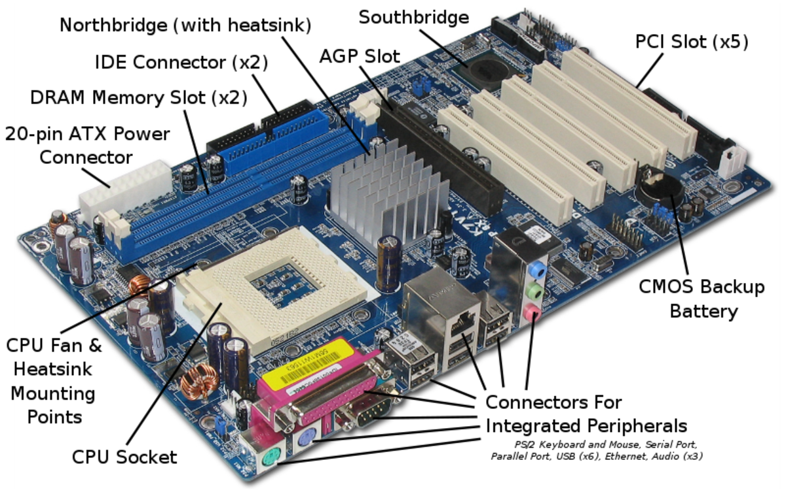

# What is Computer Science
"Computer Science is the study of computers and computational systems. Unlike electrical and computer engineers, computer scientists deal mostly with software and software systems; this includes their theory, design, development, and application.

Principal areas of study within Computer Science include artificial intelligence(facial recognition, perdictions), computer systems and networks (internet & communication), security (Cyber Security), database systems, human computer interaction (Siri), vision and graphics (games), numerical analysis, **programming languages**, **software engineering**, bioinformatics and theory of computing." (Dept of Computer Science at University of Marlyand) 

In this course we will briefly talk about computers, ways we can communicate with computers, what is software\programs and how we can use programming languages to create software\programs\apps and cover briefly some software engineering topics along the way. 

Let's talk about Computers

## What are computers?

- A computer is an electronic device that manipulates information, or data using a combination of hardware and software.
- It has the ability to store, retrieve, and process data. 
- Computers can be to type documents, send email, play games, and browse the Web.
- Computers can be a desktop computer, a laptops, a tablet, a cell phone, a smart watch or a game console like Playstation or Xbox.

Hardware and software are used togeather to provide you with a system where you can save documents, play games, send email and more. 

Let's talk about hardware and software...
## So what is hardware and what is software?

### **`Hardware represents the physical components that are needed to run a computer, such as`**:

| Hardware Components |
-------------
|**`Memory`**: Used to temporarily store tasks and data used by app(or software\programs). Think of as short term storage for data, documents, images, etc....|
|**`CPU (Central Processing Unit)`**: Processes command\tasks given by users and\or software.|
|**`Motherboard`**: Its represents the backbone that ties the computer's components together at one spot and allows them to talk to each other.
|
| **`Graphics Card and Integrated Graphics`**: Processes visual data such as movies, video games.
|
| **`NIC (Network Interface Card)`**: Provides internet for a computer.
|
| **`Hard Drives (HHD or SSD)`**: Stores files, programs for long term storage.
|
| **`Monitor`**: Provides a display for your apps\software\programs.
|
| **`Power Supply`**: Provides power to your machine.
|

### **`Software is a set of instructions, data or programs used to operate computers and execute specific tasks`**. 
Software is made up of source code (or **commands**\instructions), written using a **programming language**, and then compiled into a program for end users to consume.

Here are some examples of common software\programs\apps (or software) that you will find on a computer:

| Software Components |
-------------
|Office 365 - Microsoft Word, Excel, PowerPoint: used to created documents
|
| Email - Outlook, Gmail: used to send emails
||
| Video Games - Computer games: used to play games on a computer :)
|
| Command Console - Command consoles: used to execute **commands** on a computer.
|

Let's recap:
- What are computers?
- What is hardware?
- What is software?

So.....in order for you play games, send emails, create documents you need to tell the computer to do it. 

When you press buttons on a game controller or you're using a keyboard to type notes or send emails, in the background you're given the computer **`commands`** to execute.

Let's talk about **Commands**.

## What are commands? 
Merriam-Webster defines command as 
- to give (someone) an order: to tell (someone) to do something in a forceful and often offical way or 
- to have authority and control over (a group of people, such as soliders)  or
- **`to give orders`** to **`execute`** as task, job,etc....

When we think about commands, what are some examples that come to your mind:
- A parent\gaurdian telling you `Clean your room` or `Take the trash out` or `finish your homework`

For each command listed above (or we can think of it as a task) you either have the required skills to complete task or you have the ability ask questions on how to complete (or `execute`) the task. 

Computers work the same way. 

You give a command to a computer and it will `execute` your command, like sending emails or 

You might tell your computer how to complete (or `execute`) your request, similar to how you tell a printer how to print a page.

So what does execute mean?
- To do or perform (an action or movement that requires skill)

In the case with computers, the computer uses software which either contains the specific skils needed to execute your task or has the capbility to learn a skill set that is required to execute your task.

For example:

Who knows what is an IPhone?
The IPhone is a smartphone made by Apple that combines a **computer**, IPod(transition into ITunes), digital camera and cellular phone into one device with a touchshreen interface.

IPhones are equiped with software that end users can use to **execute** specific **commands** on your phone. For example you can use an IPhone to make a call, play games, send text or emails or ask `Siri` a question.....

### What is Siri?
- Siri is a built-in voice-controlled personal assistant that is installed on your IPhone. 
- Siri is software program.
- You can ask Siri questions such as whats the time, whats the weather like, who won the ball game last night, or to make a phone call.

When you ask Siri a question, you're actually giving the computer, in this case an IPhone, a `command` to `execute`. 

Siri has the skilsets to answer most of your questions because Siri was designed and trained to listen and understand questions or requests provided by you, and to return either a direct\relable answer or complete a task. 

In cases where Siri may not understand your question\request, Siri will ask you to repeat your question\request or it may say that it does not understand your question\request.

Siri also has the capbility to learn from you based on your phone activities. 

Such activities include adding new contacts, adding new music or games. 

As you complete these acitvities, Siri is learning more and more about you through your phone activity which in return will make Siri better to answering your questions and to complete your requets.

Let's demostrate Siri: 

`[DEMO Siri - ask Siri who won the world series this year? Share with the class.]`

**How does Siri know who won the world series?**

Every day Siri is trained to crawl data on the web.

So any events, news or general information on the web, Siri gather data and store in a location where it retrieve it to answer your questions.

## Let's recap
- A computer is a electronic device that manipulates data
- A computer is made up of hardware and software conmponents.
- Hardware represents the physical components that allow computer to function.
- Sofware is program that a computer uses to accept commands and to execute tasks.
- Some example of computers are Laptops, tables, cell phones and game concoles.
- Commands, are orders or instructions that required a computer to execute. Are one way we can communicate with computers.
- Execute is the ability to perform an action that require skills to complete an action. This is handle mostly throught software
- Siri is a built in voice command and personal assistant for end uers to ask questions or to complete requests.

So now that we have a high level understanding of how computers work and its components, let's dive into tools that we can use to communicate with a computer.

[Communicate with Computers](./Communicate_With_Computers.md)

