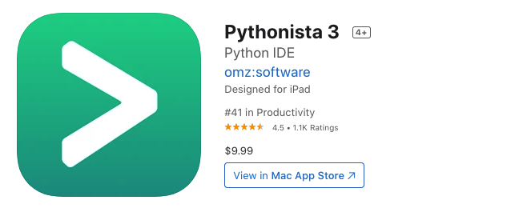
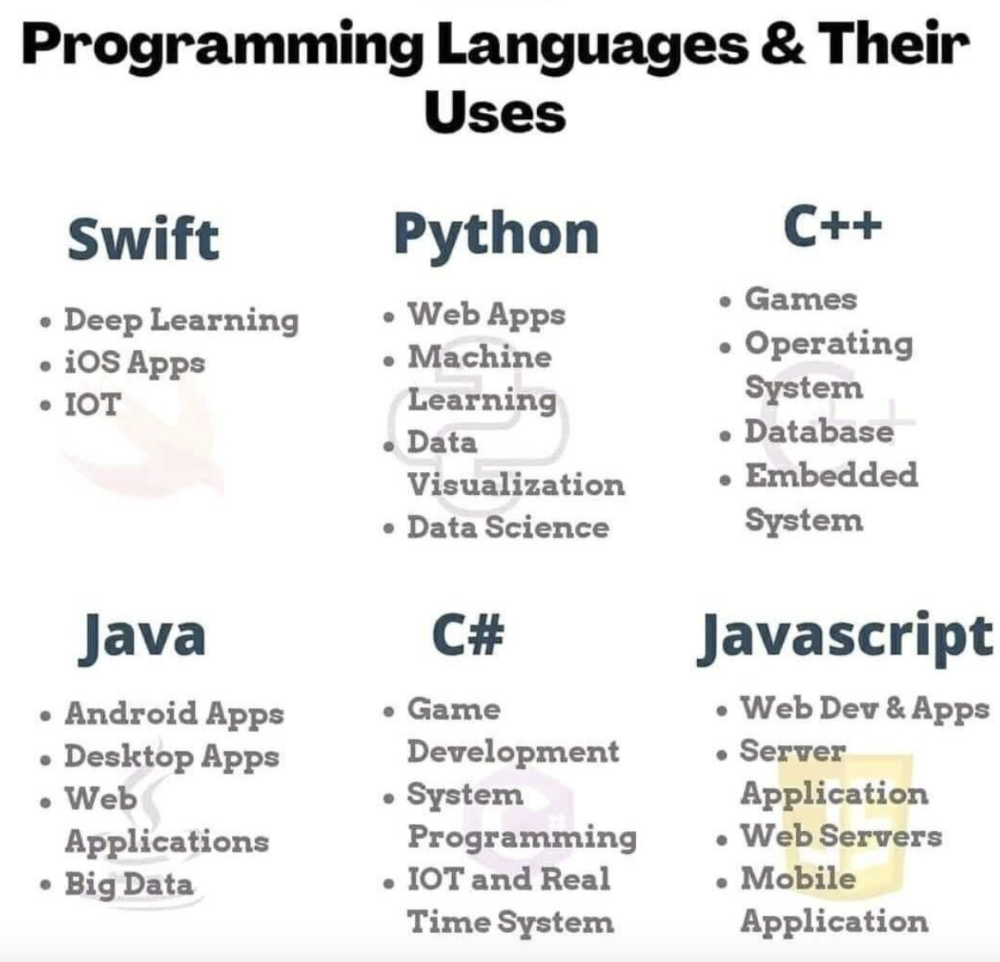
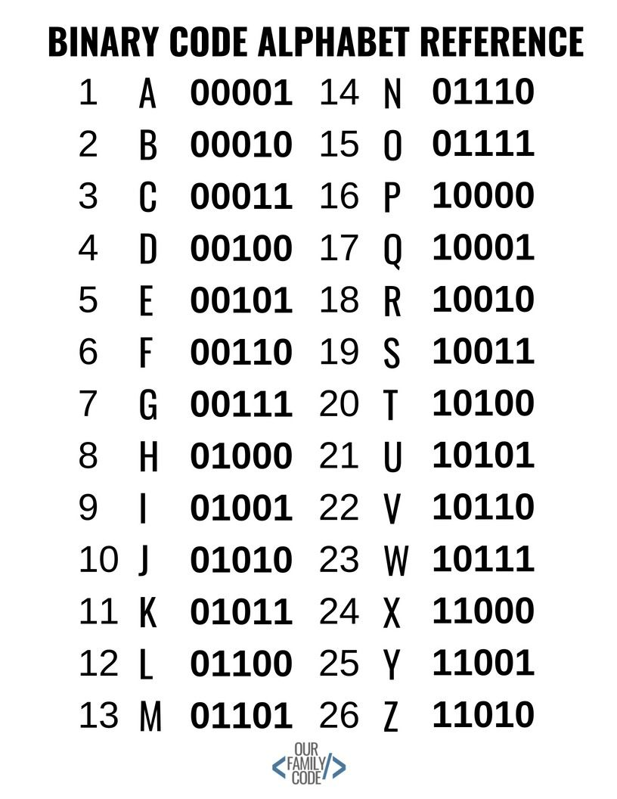

# What are programming lanagues?
[](/images/top-programming-languages.jpeg)

As you can see in the picture above, there's a bunch of lanauges out there.

 Let's talk about the `who`, `what`, `where` and `how` of `programming`

## `What` is programming ?

 
`Programming` is the mental process of thinking up instructions to give to a machine (like a computer).

We can think about programming like this....

Who remembers getting a lego set as a gift? I'm talking about the big ones, with tons of lego pieces and multiple pages of instructions on how to build it.

[](/images/LegoImage.jpeg)

- If you’ve ever build a lego set using the build instructions, you can think of yourself as the computer and the manual are written by the author(or programmer). 
- The author's manual provides you with a set of instructions which you (as the computer) read, and then build based on those instructions.. 
- The more complex the instructions, the more complex the result!”

### Why should we learning programming?

- The reason why I enjoy programming because I like the idea of creating programs to control a computer and it helps support my family and provide my kids the opporutnties I never had.

- **Programming can be used to solved problems.** 
  - We can use programming to create applications to: 
    - Automate sending reminders when to take medication.
    - To create facial recongiztion software to find criminals going through public spaces.
    - Automate sending out report cards to parents directly, instead of waiting them their kids. 

- Programming develops creative thinking. (ref [Coding 101: Programming Language Building Blocks](https://hackernoon.com/coding-101-programming-language-building-blocks-1w513uwe)
- Programming Provides Life-Changing Experiences (ref [Coding 101: Programming Language Building Blocks](https://hackernoon.com/coding-101-programming-language-building-blocks-1w513uwe)
- Programmers solve a problem by breaking it down into workable pieces to understand it better. When you start learning to program, you develop the habit of working your way out in a very structured format. You analyze the problem and start thinking logically and this gives rise to more creative solutions you’ve ever given. (ref [Coding 101: Programming Language Building Blocks](https://hackernoon.com/coding-101-programming-language-building-blocks-1w513uwe))
- "Whether you want to uncover the secrets of the universe, or you just want to pursue a career in the 21st century, basic computer programming is an essential skill to learn." - Stephen Hawking
- "Everybody in this country should learn how to program a computer… because it teaches you how to think." - Steve Jobs

## `Who` can do programming?
## Anyone......
Really anyone can learn how to program. As long as your curious, have the ability to 'think out of the box' and can solve problems, then you have the tools to program. 

You probably are know some of the programming concepts because they were tought to you in your Math classes. 

## `Where` can you do programming?

Programming can be done on a computer, a tablet, or even your cell phones. Both the Apple and Google Play stores have apps you can install on your smart phone that will allow you to program on your phone.

For larger size applications or software, like games, websites, mobile apps, you'll need a computer with larger size resources, than you typically would have on your tablet and cell phone.
For example:

- SoloLearn (avaliable in both Apple and Google Play stores.) and Pythonista 3 (avaliable only in the Apple store) are apps where you can start learning to program through your phone.

  [](/images/SoloLearn.png)

  [](/images/SoloLearn.png)

  [](/images/SoloLearn.png)


## `How` do we get started with programming ?

 To get started programming you will need the following items:


 - A computer with a text editor application..
   - A text editor is an application where you can type text into and save your work onto your computer. An example of a text editor is Notepad. Notepad is a text editor application that is installed when you install Windows onto your machine. 

      [](./images/notepad.jpeg)

      Notepad is not just the only text editor out there. There's other text editor applications that comes with more tools and features that makes programming much easier. These specific type of text editors are called IDE or Intergrated Development Environments. 
      
      We will talk more about IDE later on in this course, but just remember that you can use Notepad to start programming.
- Then the last thing you need to choose is a `programming language`. Programming languages are installed through an executable a which includes tools and other programs that will allow you to start programming and create your own programs. Next lets discuss what is a programming language.

### What is a programming language ?

- So we defined programming as the mental process of thinking up instructions to give to a machine to execute.

- A 'programming language' (or coding) is the process of transforming those ideas into a written language that a computer can understand.

- Programming languages are written in English.

- The actual instructions can be created using any document editor like notepad, Word, but when you save file, you must save using the proper file extension so you can execute your instructions. In software world, we call these instructions `source code`. We'll talk more about this later, just know the instructions that are written to a file is called source code. [Click here to read more about programming languages](https://www.codecademy.com/resources/blog/programming-languages/)

- Not all programming languages are created the equal. 
- A programming language has its own set of rules on how to code in that specific language, but all langauges uses a common set of arithmetic operators, control structures and data structures that probably has used in your math classes, such functions, tables, matrixes, '+', '-', '/', '<=', '>=' and more......
- Most applications are built using one or more programming languages. Why?
- Each programming language were designed to solve a particular problem(s) and they can also be used togeather to create biggera and better applications. Most of the websites you use today uses a multituide of languages, some are listed in the image below. 

  [](./images/notepad.jpeg)

Next let's discuss the building blocks of a programming language.

## The `building blocks` of a programming languages ? 

[Start From Here - read the articles below and include them into this section.]

https://betterprogramming.pub/building-blocks-programming-language-fundamentals-481ff296b477

What do you mean by building blocks? Let's think about the English language.
- The English language consists of nonus, verbs, adverbs, adjective, pronouns, prepositions, conjunctions and interjuctions. These are called 'Parts of Speech'. We use these elements in order to write a complete and comprehensive sentences.
- Programming languages has its own 'Parts of Speech' concept which we will call `building block elements`. These `building block elements` are a common set elements that are typically apart of any sucessful programming language.
- These elements includes:
  - `Syntax`: 
    - This tells us the rules of how to write code in a specific language. 
    - Similar to writing sentences in the English, we must have the following: 
      - A sentence must begin with a captial letter and end with a punctuation mark.
      - A sentence must contain a subject, a predicate and complete thought.
    - The same is true for a programming language. The syntax for a programming language is part of the documentation that comes with any programming language. 
  - `Semantics`: 
    - Defines the effect\meaning the instructions have(logic). 
    - This defines the understanding of your source code.  
  - `Data Types`: 
    - Defines the classification of data we want to store in memory.
    - We can think of data types as a way to define a number or text in a programming language. 
      - For example: 
        - We can define `1` as an integer data type because it represents a number. 
        - We can define `3.4` as a decimal data type because it represents a number with a decimal.
        - We can define `test` as a string data type because it represents text.
        - There's more data types outside of intergers, decimal and strings, which we will learn later on.
        - Now there's one more data type we need to know  and its important to know...This special data type is called `object`. 
        - An `object` data type is a 'catch all' for all data types. All data types inherit from an object data type. Intergers, Decimal, String are the children of an `object` data type, they inherit all the *qualities* or characteristics of an object data type.
  - `Terms:`
    - These are commonly used buzzwords we use to describe a piece of code, such as Paramters, Keywords Variables, Expressions, Statements, Functions, Classes and many more. 
    - `Literals`:
      - Is a programming is a piece of text that represents a fixed value in source code. Examples of literals:
      ```python
      123    # an interger literal
      1.23   # a floating point literal
      'test' # a string literal 
      # a boolean literal - Boolean is a data type that defines two values: True or False
      x = True  
      a = { x: 1, y: 2} # an object literal.
      ```
    - `Operators`:
      - Its a symbol that tells the compiler (or interpreter) to perform a mathematical, logical, relational or other operation as defined in the language specification.
      - For example:
        - Common operators: 
          - arithmetic: +(plus), - (minus), *( multiply), / (divide)
          - assignment: = (equals)
          - logic: !(NOT), && (AND), || (OR)
          - equality testing: ==, !=
          - function call: ()
          - increment / decrement: ++, --
          - member selection: .
          - order relations: <(less than), <= (less than or equal), > (greater than), >= (greater than or equal)
        - An operator can also be a word. For example `sizeof` is an operator in the C language  which returns  the storage created for a given data type.
        - An operator that takes one argument is called *unary operator*. For example: 
        ```python
            a++ # unary operator
        ```
        - An operator that takes two arguments is called a *binary operator*. For example: 
        ```python
          a+b # a binary operator
        ```
    - `Statements`:
      - Is a unit of executable code that does not return a value. 
      - Statements may contain a mixture of variables, operators, literals and other keywords (keywords are words that serve one specific purpose and cannot be used in any other way defined by the programming language).
      - For example:
      ``` python
      # Simple statements
      a = 10 # variable a
      b = 9 # variable b
      a = b # We are assigning the value of variable b to the value of variable a. In case we are overridding the value. 
      # Return statement
      return a # returns the value of variable a.
      # if statements
      if(a < b) return c:
      # loop statements
      for a in numbers { 
        print(a) 
      }
      # switch statements
      fruit = 'Banana'
      if fruit == 'Mango': 
          print("letter is Mango") 
      elif fruit == "Grapes": 
          print("letter is Grapes") 
      elif fruit == "Banana": 
          print("fruit is Banana") 
      else: 
          print("fruit isn't Banana, Mango or Grapes") 
      ```
    - `Expressions`:
      - A unit of executable code that returns a value.
      - Examples are:
      ```python
        1 + 2 # uses the binary operator to return the value 3
        a * b # uses the '*' operator and returning a multiplied by b
        !a    # uses the unary operator and returns a boolean value (false)
        # Expressions and statements can be combined
        a = b + c # this statement says take the binary operator '+' and add the value of variable 'b' and 'c' and then assign the value to variable 'a' 
        # b + c is an expression
        # a = b + c is a statement.
      ```
    - `Operator Precedence and Associativity`:
      - Is the set of rules that determines in what order operators are applied within a complex expression.
      ``` python
      (2 -1 ? 0 : 1) == 0 # this expression and statement says:
      # 1. subtract '1' from 2'
      # 2. '?/ represents the if statement. If 2-1 is equal to '0' (defined by '== 0).
      # If 2-1 is equal to 0, then return '0' else return '1'
      ```
    - `Functions`:
      - Its a reusable block of code that performs a specific task.
      - Example:
      ``` python
        # AddTwoNumbers is a block of code that will add two numbers and return it to its caller.
        # This is one of the ways how functions are defined in Python.
        def AddTwoNumbers(A, B): 
            return A+B
        print(AddTwoNumbers(1,2)) # print() is also a function that display data to a screen.

      ```
    - `Class`:
      - Is a blueprint for that defines the properties and functions common to all objects of a certain kind.
      - We can think a class like a car
      ``` python
       class Car:
         # These are properties of a car object or the characteristics of a car. 
         bodyColor: str
         Miles: int
         modelName: str
         vendorName: str
         wheelSize: str
         gasTankSize: int
         Speed: int
         IsWipersOn: bool
         IsCarOn:bool
         TurnCarRight: bool
         TurnCarLeft: bool
         def __init__(self, Vendor, Model, WheelSize, BodyColor, GasTankSize): # this is called a constructor
             # A constructor is a special function.
             # This function is called when you create an instance of an object. 
             # We can use the constructor to initalize or prepare the object to be used.
             self.bodyColor = BodyColor
             self.modelName = Model
             self.vendorName = Vendor
             self.wheelSize = WheelSize


         def StartCarEngine():
             # This function when called with start the car engine.
             self.IsCarOn = True
             return self.IsCarOn 
         
         def ShutOffCarEngine():
             self.IsCarOn = False
             return self.IsCarOn

         def TurnOnWindshieldWipers():
              # This function has instructions to turn on the car's windshield wiper 
              self.IsWipersOn = True
              return self.IsWipersOn
          
         def TurnOffWinshieldWipers():
             # This function has instructions to turn off the car's windshield wiper.
             self.IsWipersOn = False
             return self.IsWipersOn

         def MakeTurn(self, TurnDirection):
             if(TurnDirection == 'Right'):
                self.TurnCarRight = True
                self.TurnCarLeft = False
             elif (TurnDirection == 'Left'):
                   self.TurnCarLeft = True
                   self.TurnCarRight = False

        # Here is how to create a the Car object in memory
        newCar = Car() # this statement will create a new Car object in memory and call the __init__(self): function.
             
      ```
    - `Strucs`:
  - `Data Structures:` 
    - A data structure is how we can store, access, organize and manage the data we have created in a computer, like lists, arrays, etc...
    - You can think of data structures as a table. With tables you can store data within a table, you can organize the data by sorting the data and you can access data by referring to its row and\or column positions.
    - Just think of data structures as a collection to store data.
  - `Algorithms:` 
    - An algorithm is a step-by-step procedure to solve any computational problem. 
    - For example Fibonacci Sequence - this is a sequence of numbers and the next number is found by adding the two numbers before it. 

### Let's see how some of these concepts are used in the example source code provided below.

Provided below is source code that adds two numbers togeather. The source code is written Python. Python is a programming used to create desktop, web and mobile applications. We will talk about Python in the next section.

- `def AddTwoNumbes(A,B):` 
  - defines the `syntax` on how you create functions in Python.
  - The `semantics` tells Python that this an function that accepts two parameters. Parameters are inputs you provide to a function. We'll talk about this more in the following sections.
  - The `terms` used here are `functions` and `parameters`. 
    - `functions` are reusable collection of instructions that will `execute` when called upon. 
    - `def` is a keyword, which its a special reserved word tha the target programming languages uses to define objects. In code below `def` defines a function in Python.
    - `parameters` are inputs you provided to a function.
- `return A+B`
  - defines the syntax to add two values togeather return it back to the caller. Who is the caller in this case? `print(AddTwoNumbers(10,9))` 
  - The `semantics` tells Python to add the value of A and B and return the value back to the caller.
  - The `terms` used here are `expressions`, where the `A+B` tells Python to add two values and then `return` the call value to the caller.
- So what does `print(AddTwoNumbers(10,9))` tells Python to do?
  - Call the `AddTwoNumbers` function and 
  - Pass in two `parameters` A and B, and 
  - `print` our the results to the screen.
- `QUESTION - What are the data types of the two parameters passed into the AddTwoNumber function?`
```python
# Function for adding two numbers
def AddTwoNumbers(A, B): # <= defines a function.
	  return A + B # <= defines an operation and instructions

# prints the results to the screen
print(AddTwoNumbers(10,9))
```
## Lets take a 5 minute break

## Or a better title is How are programs created and executed from our source code.
## Lets talk about how to programs, meaning are program created and executed. [CONTINUE HERE]
Now there are many more concepts that we will cover later on in this course, but I want you to undersatnd the basic building blocks of a programming language, but they don't change from one language to another.


- Computers “think” in binary — strings of 1s and 0s. 
 
   [](./images/binarycode.jpeg)
- Programming languages allow us to translate the 1s and 0s into something that humans can understand and write. 
# TODO
- Talk about how to execute your program on a computer.
- Explain how source code is translated into binary
- Talk about compilers at a high level.
- Explain that they're different ways programs are created based on the programming language.
- Create a program that will write a person's name is binary
- Last statement should lead into the next section which is Python and then link to the Python discussion.
###Ok, so how does a computer know how to run my program?

[](https://www.youtube.com/watch?v=QXjU9qTsYCc)


Programming languages comes with its own built 'translator' to translate the source code into binary code.

For example: 

C#, its a compiled programming language, where a machine (computer) has the tools to translate your source code into binary code (machine code) in order to run your program.

Python, is a interpreted language, where it uses a program called an interpreter (think of it as a sandbox), that will read and execute your source code. The interpreter comes with Python installed package.


Now, not all programming lanagues are made equal. Some langauges can be used to create various applications, while others are designed to one or two things specifically.


In this course we will focus on the Python programming language. 

How is a python a programming language?


It's not!!! I'm not talking about the snake called Python, I'm talking about about a programming language named Python.


So.....What is Python?


## Lets take a 10 minute break
- Get up from your chairs, move around, get a drink and stretch.

## What is Python and how can it be use
- Its program language that can be used to do 'stuff' on computers.
- Its a interpreted language....What does that mean???
  - Most programming language is written using the English language. For example: In python the 
  -  Computers has their own language, which is called binary.
  - The source code Every program\or software is a set of instructions, whether its to add two numbers or send an email over the internet.
  - Compilers and interpreters
- First developed in the late 1980s by Guido van Rossum.
- Its used for creating websites, creating software, creating games, used in mathematics and more. 

[Guido van Rossum](https://gvanrossum.github.io/)


Python allows you to create desktop, web and mobile applications. Python can be used to create games, send emails, create websites and more.....
### Download and Install Python
### How to look for help

Labs
Lab 1 - Learn how to use the command window 
Lab 2 - Using Python’s IDLE
Assignments - In class work
Running some Commands
Use echo to display text.
Display the current time
Display the operating system version
Display MAC address
Display connection and status
Display Architecture Type (32 or 64 bit) - echo %PROCESSOR_ARCHITECTURE%
Download,Install and run Python
Download the correct Python package
Run the installer
Configure the Python installation
Start the IDLE and check the Python version.

