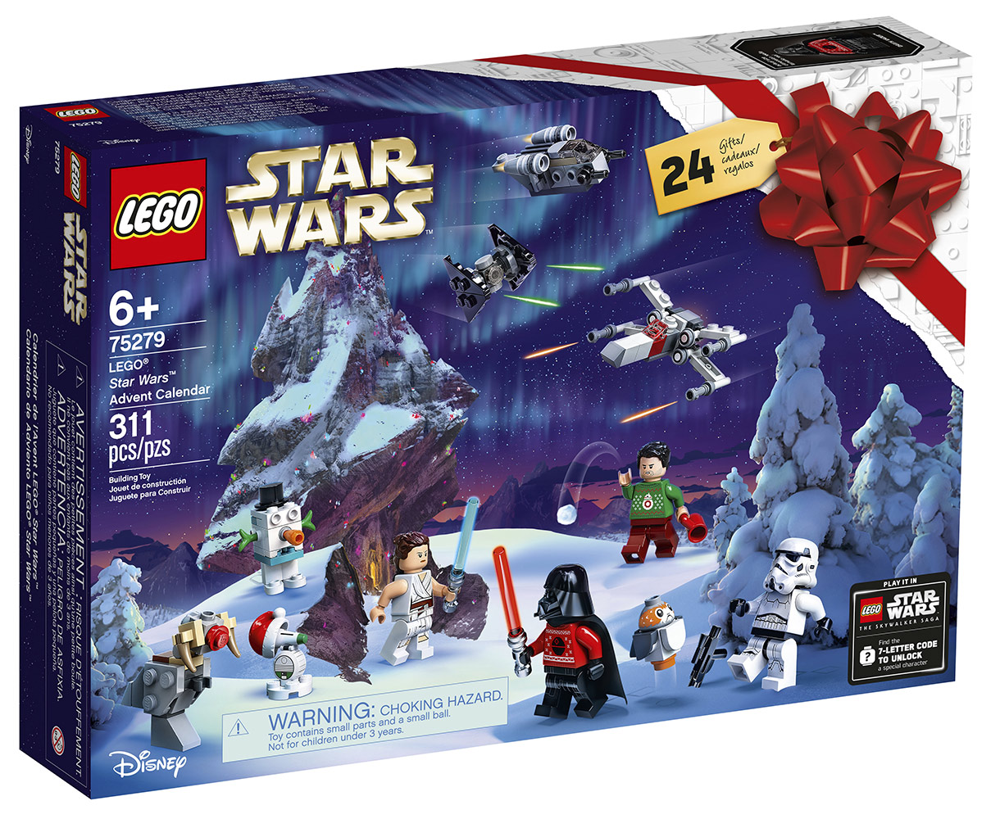

# What are programming lanagues?


As you can see in the picture above, there's a bunch of lanauges out there.

## Let's break down what is programming and what is a program language and why we should learn programming

### What is programming ?

`Programming` is giving a set of instructions to a computer to execute. 

We can think about programming like this....

Who remembers getting a lego set as a gift? I'm talking about the big ones, with tons of lego pieces and multiple pages of instructions on how to build it.

[](./LegoImage.jpeg)

- If you’ve ever build a lego set using the build instructions, you can think of yourself as the computer and the instructions the author or programmer. 
- The instructions provides you with a set of instructions which you (as the computer) read and then follow. 
- The more complex the instructions, the more complex the result!”

### What is a programming language ?
`Programming languages` are the tools we use to write instructions for computers to follow. 

- Computers “think” in binary — strings of 1s and 0s. 
 
   [](./binarycode.jpeg)
- Programming languages allow us to translate the 1s and 0s into something that humans can understand and write. 

- A programming language is made up of a series of statements that serves as a bridge that allow humans to translate our thoughts into instructions computers can understand.
- The actual instructions can be created using any document editor like notepad, Word, but when you save file, you must save using the proper file extension so you can execute your instructions. In software world, we call these instructions `source code`. We'll talk more about this later, just know the instructions that are written to a file is source code.

[Click here to read more about programming languages](https://www.codecademy.com/resources/blog/programming-languages/)

Let's see what we can do with programming languages:
- You can create online, mobile and desktop games.
- You can create a website for posting information online like a blog or a fourmn
- You can create an applications for your business to help track sales, inventory and process online orders.
- You can also create online tools for education, like Google Classroom. Google Classroom virtualize the learning experience by offering teachers and students a space create, complete and collobrate on class assignments.

### Why should we learning programming?

The reason why I enjoy programming because it motivates me to learn and I like the idea of creating programs to control a computer.

### Let's look at othe reasons why we should learn programming...
- Programming develops creative thinking. (ref [Coding 101: Programming Language Building Blocks](https://hackernoon.com/coding-101-programming-language-building-blocks-1w513uwe)
- Programming Provides Life-Changing Experiences (ref [Coding 101: Programming Language Building Blocks](https://hackernoon.com/coding-101-programming-language-building-blocks-1w513uwe)
- Programmers solve a problem by breaking it down into workable pieces to understand it better. When you start learning to program, you develop the habit of working your way out in a very structured format. You analyze the problem and start thinking logically and this gives rise to more creative solutions you’ve ever given. (ref [Coding 101: Programming Language Building Blocks](https://hackernoon.com/coding-101-programming-language-building-blocks-1w513uwe))
- "Whether you want to uncover the secrets of the universe, or you just want to pursue a career in the 21st century, basic computer programming is an essential skill to learn." - Stephen Hawking
- "Everybody in this country should learn how to program a computer… because it teaches you how to think." - Steve Jobs

Next let's discuss the building blocks of a programming language.
## What are the 'building blocks' of programming languages ? 

- Programming languges differ based on their purpose, how to we write source and their meaning and structures they use. 
- Some have the ability to create programs while others are used to manage data.
- But for all programming languages they consist and they're build upon the following concepts:
  - `Syntax:` 
    - Defines the rules for how each instruction is written. 
    - Basically this tells us the rules we have to use to write source code in a particular programming language.
  - `Semantics:` 
    - Defines the effect\meaning the instructions have(logic). 
    - This defines the understanding of your source code.  
  - `Data Types:` 
    - Defines the classification of data we want to store in memory. 
    - Data Types vary from one language to antoher, but the type of data we want to store it in are common across all languages.
    - For example:
      - Objects  
        - 1 or B, Brandon are all consider objects. 
        - Objects is anything that is visable or tangible and is relatively stable in form. 
        - In the world of progrmming, the instructions\source contains objects. We can use objects to data for any type.
      - Integers, Floats, Decimal, Double
        - These are data types that accept numeric value like 1, or 1.0 or 0.000234 or $123.34
        - Each data type varies in size and can be used different ways. For example: we can Decimals in financial applications to ensure a high level of accuracy or Floats in scientific applications or Doubles and Integers are used to store whole and decimal numbers which are used mostly in all applications.
      - Character and Strings
        - These are data types that are represented as texts, liie 'B' or 'Brandon' or '1' or '0.0000123'.
        - Do you see the difference?
  - `Terms:` 
    - These are commonly used buzzwords we use to describe a piece of code, such as Paramters, Keywords Variables, Expressions, Statements, Functions, Classes and many more. 
    - These are if/else, while loops, greater or less signs ('>' or '<'), plus and minus signs ('+' or '-') and many more., 
    - We will discuss this later on in the course. 
  - `Data Structures:` 
    - A data structure is how we can store, access, organize and manage the data we have created in a computer, like lists, arrays, etc...
    - You can think of data structures as a table. With tables you can store data within a table, you can organize the data by sorting the data and you can access data by referring to its row and\or column positions.
    - Just think of data structures as a collection to store data.
  - `Algorithms:` 
    - An algorithm is a step-by-step procedure to solve any computational problem. 
    - For example Fibonacci Sequence - this is a sequence of numbers and the next number is found by adding the two numbers before it. 

### Let's see how some of these concepts are used in the example source code provided below.

Provided below is source code that adds two numbers togeather. The source code is written Python. Python is a programming used to create desktop, web and mobile applications. We will talk about Python in the next section.

- `def AddTwoNumbes(A,B):` 
  - defines the `syntax` on how you create functions in Python.
  - The `semantics` tells Python that this an function that accepts two parameters. Parameters are inputs you provide to a function. We'll talk about this more in the following sections.
  - The `terms` used here are `functions` and `parameters`. 
    - `functions` are reusable collection of instructions that will `execute` when called upon. 
    - `def` is a keyword, which its a special reserved word tha the target programming languages uses to define objects. In code below `def` defines a function in Python.
    - `parameters` are inputs you provided to a function.
- `return A+B`
  - defines the syntax to add two values togeather return it back to the caller. Who is the caller in this case? `print(AddTwoNumbers(10,9))` 
  - The `semantics` tells Python to add the value of A and B and return the value back to the caller.
  - The `terms` used here are `expressions`, where the `A+B` tells Python to add two values and then `return` the call value to the caller.
- So what does `print(AddTwoNumbers(10,9))` tells Python to do?
  - Call the `AddTwoNumbers` function and 
  - Pass in two `parameters` A and B, and 
  - `print` our the results to the screen.
- `QUESTION - What are the data types of the two parameters passed into the AddTwoNumber function?`
```python
# Function for adding two numbers
def AddTwoNumbers(A, B): # <= defines a function.
	  return A + B # <= defines an operation and instructions

# prints the results to the screen
print(AddTwoNumbers(10,9))
```
## Lets take a 5 minute break

## Lets talk about how to programs, meaning are program created and executed. [CONTINUE HERE]
Now there are many more concepts that we will cover later on in this course, but I want you to undersatnd the basic building blocks of a programming language, but they don't change from one language to another.

# TODO
- Talk about how to execute your program on a computer.
- Explain how source code is translated into binary
- Talk about compilers at a high level.
- Explain that they're different ways programs are created based on the programming language.
- Create a program that will write a person's name is binary
- Last statement should lead into the next section which is Python and then link to the Python discussion.
###Ok, so how does a computer know how to run my program?

[](https://www.youtube.com/watch?v=QXjU9qTsYCc)


Programming languages comes with its own built 'translator' to translate the source code into binary code.

For example: 

C#, its a compiled programming language, where a machine (computer) has the tools to translate your source code into binary code (machine code) in order to run your program.

Python, is a interpreted language, where it uses a program called an interpreter (think of it as a sandbox), that will read and execute your source code. The interpreter comes with Python installed package.


Now, not all programming lanagues are made equal. Some langauges can be used to create various applications, while others are designed to one or two things specifically.


In this course we will focus on the Python programming language. 

How is a python a programming language?


It's not!!! I'm not talking about the snake called Python, I'm talking about about a programming language named Python.


So.....What is Python?


## Lets take a 10 minute break
- Get up from your chairs, move around, get a drink and stretch.

## What is Python and how can it be use
- Its program language that can be used to do 'stuff' on computers.
- Its a interpreted language....What does that mean???
  - Most programming language is written using the English language. For example: In python the 
  -  Computers has their own language, which is called binary.
  - The source code Every program\or software is a set of instructions, whether its to add two numbers or send an email over the internet.
  - Compilers and interpreters
- First developed in the late 1980s by Guido van Rossum.
- Its used for creating websites, creating software, creating games, used in mathematics and more. 

[Guido van Rossum](https://gvanrossum.github.io/)


Python allows you to create desktop, web and mobile applications. Python can be used to create games, send emails, create websites and more.....
### Download and Install Python
### How to look for help

Labs
Lab 1 - Learn how to use the command window 
Lab 2 - Using Python’s IDLE
Assignments - In class work
Running some Commands
Use echo to display text.
Display the current time
Display the operating system version
Display MAC address
Display connection and status
Display Architecture Type (32 or 64 bit) - echo %PROCESSOR_ARCHITECTURE%
Download,Install and run Python
Download the correct Python package
Run the installer
Configure the Python installation
Start the IDLE and check the Python version.

