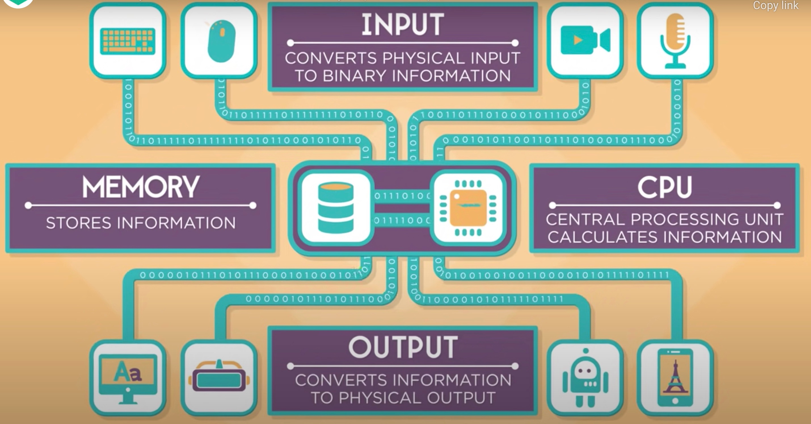
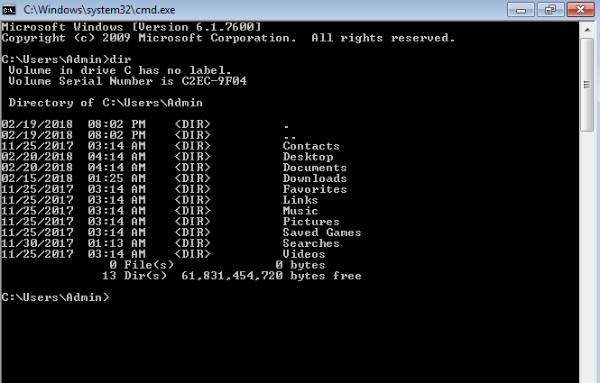
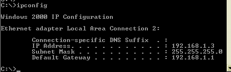
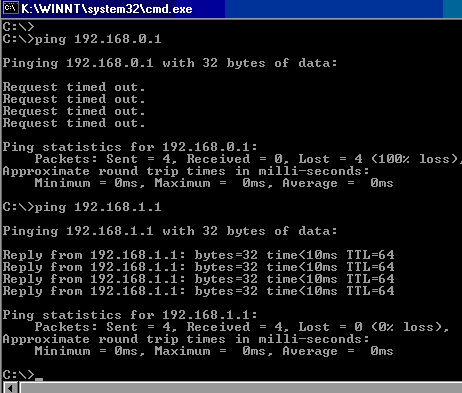

# How do we communicate with computers
There's a couple of ways we can communicate with computers:
- Using a keyboard
- Voice commands
- Game Controllers
- Live Streams
- Touch pad
- Drones
- Sensors like motion detections    

We can call keyboards, voice commands, game controllers, live streams and sensors, `INPUTS`.

Each of these `INPUTS` produces a `command` for a machine (computer, tablet, game console, smart phone or smar watch) to `execute`. 

So this `command` is genreated by the input into a language or code called `Binary`. Binary code can be represented by any two symbols such as 1s and 0s. You can think of binary is a collection of off and on switches. For example:

This is `Brandon` spelled out in binary code

`01100010011100100110000101101110011001000110111101101110`  

Binary code or binary language or machine language or machine code, is basically code\language that machines understands. We'll talk more about binary later in the next section, but the point that I want you get here is that Inputs products commands in the form of `binary` code.  

Using the diagram below let's take a look at how `commands` from an input are communicated or processed to a machine for execution. 

- **Input**:  Converts physical input to binary information (or binary code).
- **Memory**: Stores information
- **CPU**: Center Processing Unit calculates information.
- **Ouput**: Converts information to physical output.

## Example - What happens when I press keys on a keyboard
- Let's say I'd pressed key letter B on a keyboard. 
- Next the keyboard converts the letter B into a number or scan code (each key has one).
- Then from the input, the number is sent as binary, ones and zeros (101100111110), into a computer.
- Then the CPU calculcates how to display the 'B' pixel by pixel. 
- The CPU requests step by step instructions from memory on how draw the letter B.
- CPU execute these instructions and stores the results into memory.
- Finally the pixel information is sent in binary to the screen.
- The screen is output device, like a monitor. The monitor converts the binary data into the tiny lights and colors that you see on a screen. This is also true for Facetime, playing video games or sending texts.

There's one thing thats missing from this picture that works with a machine to gather data from inputs and helps processes data. That one thing is....**Programs**

## Programs
A program (or software program) is commonly defined as a set of instructions, or a set of modules or procedures, that allow for a certain type of computer operation. The term is also often used interchangeably with terms like “software application” and “software product.”

In the diagram above, its assume you know that the Operating System assists in processing input and producing output.

What's an operating system? 
- Its software, its a program thats installed on a computer and its job is to manage your computer and all the software that runs on the computer. 
- An opearting system uses other software to protect the computer from malware and virous.
- An operating system also monitors programs to make sure they don't consume to much of your primary resources like memory, cpu and\or hard drive spaces.
- Windows 10, MacOS, IOS are operating systems.

Operating systems is example of one program, but they're many more like:
1. A command console
2. Microsoft Paint
3. Solitaire
4. Many more..... 

Let's take a look at `command consoles` which is a program that is used by system adminstrators to manage machines, apply updates and assist in troubleshooting issues such as fixing internet issues or apply software updates.
### Command Consoles\Prompts 

A command console is a command based application that is used to run and execute commands that you give it through the command prompt.

A command consoles are used perform specific tasks based on the commands you type in.

You can use command consoles for
- Manging files and folders like creating files, changing the name of a folder or file or deleting files and folders.
- Gathering information about your computer such as OS info, which Wifi network you connected to and more..
- See which devices are connected to your wifi network.
- Start and stop programs.
- Applying software updates.

Command consoles works just like any application:
- When you open a command window, the command console opens under your profile working directory, which looks like `C:\Users\<Profile Name>`
- User types the commands into a keyboard and the commands appear in the console window.
- Commands are processed and executed once your hit the enter key on the keyboard. 
- Once the enter key is pressed, then the application begins processing your commands.
- Once the console completes executing command, then in the window you will either see the results from your command or an error. 
    - An error is simiply a message stating there was a problem processing your command.

Provided below is a picture of a command console.

Let's try running some commands using the console command on your machine.

You use the link beloProvided below are instructions on how to bring up a command console using Windows.

[How to Open Command Prompt (Windows 11, 10, 8, 7, etc.)](https://www.lifewire.com/how-to-open-command-prompt-2618089)

## Excerise 1: Lets write some text to a screen and create some folders and files.
Once you have your command window open let's display some text using `echo` command:

- Type into the command window: `echo Hi my name is Clarence Ellis` and then hit the Enter Key. What do you see?
    - Who is [Clarence Ellis](https://medium.com/@mayborn_unt/clarence-skip-ellis-the-first-black-ph-d-in-computer-science-6ccae49b148) ? 
        -    This first African American to receive a PhD in computer science.
        - At Palo Alto Research Center he headed a group that invented and developed Office talk - the first office system to use icons and Ethernet to allow people to collaborate from a distance. His work led to creation of software packages we use today, like `Google Docs`.
        - He held teaching positions at Standford, University of Texas, MIT and Stevens Institute of Technology.
- Next, type into the command window: `echo Why was Katherine Johnson called the HUMAN COMPUTER at NASA?`
    -   Who is [Katherine Johnson](https://www.nasa.gov/audience/forstudents/k-4/stories/nasa-knows/who-was-katherine-johnson-k4)?
        - An African American mathematician who calculated and analyzed the flight paths of many spacecraft missions for NASA.
        - She help NASA put an astronaut into orbit around Earth and then help put a man on the Moon !!!

Next let's create a folder and then a file

- Type into the command window `cd Desktop`  and then hit the enter key. 
    - This will change your working directory to the to your profile's **Desktop** directory. 
    - Moving forward any files and folders you create will be exist under the Desktop folder.
- Type into the command window `mkdir ComputerFiles` and then hit the enter key. 
    - This will create a brand new directory called **ComputerFiles**
- Next type into the command window `cd ComputerFiles` and then hit the enter key. 
    - This will change your working directory to the **ComputerFiles** directory.
    - Any files and folders you create moving forward will be created under this directory until you run the change directory command to another directory.
- Type into the command window `dir` and hit the enter key.
    - This will display all the files and folders within your current directory.
- Type into the command window `echo My name is (enter your name) > sample.txt` and then hit the enter key.
  - This will write the text **'My name is Brandon Hunter'** into a text file **sample.txt** file.   
- Finally, type into the command window `dir` and hit the enter key.
    - This will show you the file you just created in the current directory.

### Provided below are some comman commands that can execute using the command console.

| Commands | Description | Example |
|----------|-------------|---------|
| **cls** | This command wipes the command screen clean | cls |
| **Systeminfo** | This command give you a detailed configuration overview for your computer. | systeminfo |
| **tasklist** | This command provdes a current list of all tasks running on your PC. | tasklist |
| **title** | This command chnage the title of the command prompt window. | title New Title
| **color** | This command changes the background color of the command prompt window. | color 1 9 |

**Note:** Here are color codes that you can use with the **color** command
| Background Color Code | Foreground (text) Color Code| Example |
|-----------------------|-----------------------------|---------|
| 0 (Black) | 8 (Gray) | color 0 8 |
| 1 (Blue) | 9 (Light Blue) | color 1 9 |
| 2 (Green) | A (Light Green)| color 2 A |
| 3 (Aqua) | B (Light Aqua)| color 3 B |
| 4 (Red) | C (Light Red)| color 4 C |
| 5 (Purple) | D (Light Purple)| color 5 D |
| 6 (Yellow) | E (Light Yellow)| color 6 E |
| 7 (White) | F (Bright White)| color 7 F |

## Excrise 2: Network troubleshooting

- Lets say you're on the phone with someone from IT support and they ask you `What is the hostname of your machine?`. What do you do?
    - From a command window type in the following command: `hostname` and then hit the enter key. This will provide the hostname of your computer which is the unique name assigned to your computer.
- Let's say IT support ask for your machine's IP address?
    - What is an IP address? 
        - You can think of it as a unique address that is assigned to your computer. 
        - Every computer has an IP address and every website has an IP address. Pretty much any device on the internet has a unique IP address.
    - Type into the command window `ipconfig` and hit the enter key. 
        - You should see something similar to the image below:
        
            
- You're having trouble reaching out to google.com using your browser on your computer, and you think google.com is down. How do you check if you can't get to it using the browser.
    - We can use the `ping` command. The ping command sends a short message to a device or website (device) to see if it will respond.
    - Type into the command window `ping google.com` and then hit the enter key.
    - Provided below are the result: 
        - The first ping responds with a request timeout which could mean that the website is down or you have a problem with your local network.
        - The second ping shows a sucessful ping meaning that your computer can reach to the website, so maybe the problem might be with the software you're using to access the website.

            

## Lets Recap 
- We communicate computeres using keyboards, voice commands, IoT devices, sensors, drones and live streams. 
- Each of these ways of communication are called `Inputs`.
- `Inputs` then takes the users actions (clicking keys on a keyboard or using voice commands), converts that information into binary code.
    - Binary code (or machine language) is a language that computers understands. 
    - Binary code contains information which the computer will process and provide results for the end user.
- Once the binary code is captured from the Input, the binary code is sent to `Memory` and `CPU` to process the information.
- Once the information has been processed, then the information is sent to an `Output` to display the results.
    - What are Inputs? Inputs converts physical input to binary information. 
    - Memory: Stores information captured from inputs.
    - CPU: Center Processing Unit works on the information captured from the Input and completes thet task.
    - Ouput: Converts information to physical output. This can be a cell phone scree, a monitor or a repsonse from a computer or cell phone.
- Programs are a `set of instructions, or a set of modules or procedures, that allow for a certain type of computer operation`.
    - Examples of programs are command consoles, video games, email clients,etc...
    - Command consoles is an application used to manage computers.
    - Command consoles can be used for:
      - Troubleshooting network issues
      - Creating files and folders
      - Starting and stopping programs
      - Gather metadata about your computer.

Next we're going to look at programming languages. Programming languages are used to build programs that we use everyday. 
### Let's take a 10 minute break to stretch, go to the bathroom or to get something to each.

[Next up...Programming Languages](https://github.com/brandonmichaelhunter/UMASAV/blob/beetle/Day1/Programming_Languages.md)
