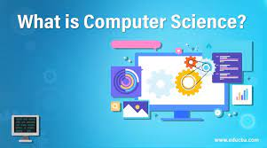
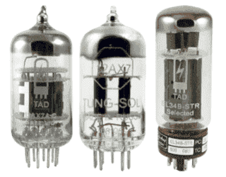

# What is Computer Science?

## Its about solving problems using COMPUTERS!!!

`"Computer science develops students’ computational and critical thinking skills and shows them how to create, not simply use,new technologies. This fundamental knowledge is needed to prepare students for the 21st century, regardless of their ultimatefield of study or occupation. `

`Computer science education encompasses 'the study of computers and algorithmic processes, including their principles, their hardware and software designs, their applications, and their impact on society.`

A few of the topics and activities that might be included in a computer science course include:
- Algorithmic problem-solving
- Computing and data analysis (managing, processing, visualizing and interpreting data)
- Human-computer interaction
- Modeling and simulating real-world problems
- Creating and manipulating graphics
- Programming (including game design)
- Security (including cryptography)
- Web design (illustrating principles of programming, human-computer interaction and abstraction)
- Robotics (designing and programming)
- Ethical and social issues in computing"

Ref: [Code.org](https://code.org/files/computer_science_is_foundational.pdf)

## Let's take an indepth look into the concepts of computer sicence

# Computers - What are computers and how do they work

## What is a computer?
- A programmable device for processing, storing, and displaying information or 
- An electronic device that manipulates information (or data) using a combination of hardware and software
## What are some examples are a computer?
- We know of desktop and laptop computers, but what about....
  - Cell Phones
  - Tablets 
  - Drones
  - Smart Devices (Washers, Dryers, Refrigerators, Watches, Theromstats, Cars)
  - Game Consoles (XBox, PlayStation)
## What can you do with computers? 
- Work with documents, presentations, spreadsheets and save them to a computer.
- Send emails
- Play computer games and more....
In this section we'll disucss what are computers, how do they work and what are the parts that make up a computer.

The first step before start learning how to program, is learning how computers work.
## What are computers?

*"A computer is a machine or device that performs processes, calculations and operations based on instructions provided by a software or hardware program. It has the ability to accept data (input), process it, and then produce outputs.*

*Computers can also store data for later uses in appropriate storage devices, and retrieve whenever it is necessary.*

*Modern computers are electronic devices used for a variety of purposes ranging from browsing the web, writing documents, editing videos, creating applications, playing video games, etc.*

*They are designed to execute applications and provide a variety of solutions by combining integrated hardware and software components.*

*The earliest digital electronic device that could be defined as the first modern computer is the Colossus. Built in 1943-44, the Colossus was devised to crack the Lorenz SZ 40/42, a German encryption machine used to support military communications during World War II.*

*The device used 2,400 vacuum tubes to perform multiple boolean logical operations to decode encrypted data.*"

Ref: [techopedia](https://www.techopedia.com/definition/4607/computer)

## How do computers work

### Binary & Data

FIX NOTES
Binary and Data
- Computers understands binary data, 1's and 0's. 
- Any human or software related actions is translated into 1s and 0s for the computer to execute.
- Electric wires and circuts play an important role on how data is managed within a computer.
  - Electricity moving throug wires can represent a yes or no, true or false or 1 or 0. This on and off state is called a bit.
- Binary Number System uses 1s and 0s.
  - 1s and 0s are used by computers.
  - Its used to stored data for computers to read and process.
  - How do we count using the Decimal Number System? We use positions, right. For example: 319 - 3 represents the hundreds place, 1 represents the tenth place and 9 represents the ones place.
  - The Binary Number System also uses positions to count numbers. Let's take the binary code 
  - Each position is goes by the multiplying the previous place number by it self. So in binary placement system it goes, 1, 2, 4, 8, 16, 32, 64, 128, 256,etc....
  

  |16s pace |8s place   |4s place  |2s place   |1s place   |
  |---------|-----------|----------|-----------|-----------|
  |     1   |    1      |    1     |  1        |  1        |
  
  PICK UP FROM HERE
- Computers work on 1's and 0's play a big role into how computers work.
- Inside a computer are electric wires and circuits that carray all the information in a computer. How is information stored using electricity?
  - Using wires. One wire can represents a yes, or no, true or false, or 1 or 0 or anything with two options. This on or off state is called a bit.
  - using more wires you can use more bits, which can results represent more complex informaiton and the largest numbers you can store.
- What is a Bit - smallest piece of information you can store. With more bits you can represents more complex information.
- The Binary Number System
 - Decimal System we have 10 digits 0 - 9
 - Binary System we only two digits zero and one, which we can use to count up to any number.
 - Decimal System we use the positions to represent the number, 123 - 3 represents the 1 positions, 2 represents the 10s position and 1 represent the 100s position. In the decimal system we multiply by 10 for each position.
 - In the Binary System, the same is true.
 - In the binary system we multiple each position by 2. For example: 
   8s|4s|2s|1s
   1  0  1  0
   1010 - represents the number 10. Here is how: 1 (1x8) - 0 (0x4) - 1(1x2) - 0(1x1)
 - Now we don't have to do this math. What is important that any number can be represented by ones and zeros.
 - With 8 wires you can store numbrs between 0 and 255 or 8 1s (11111111)
   1-1-1-1-1-1-1-1
   (1*128)+(1*64)+(1*32)+(1*16)+(1*8)+(1*4)+(1*2)+(1*1) = 255    
 - 32 wires we can store from 0 to 4 billion           
 - Text, Images, Sound and more can be represented using numbers.
 - Every word you see on a web page or your phone is represented using a system like this, a sequence of binary numbers to represent text, images and sound.
 - For each pixel can represent a number and a number can be represented by binary.
 - Sound - any sound can be broken down in a series of numbers.
 - Binary are the backbone of how all computers input, store, process and output information.
 - 
### Crcuits and Logic

# INCLUDE AN EXCERISE
### CPU, Memory, Input & Output

### Hardware and Software

Let's take a deeper look into the hardware components of a computer

# INCLUDE AN EXCERISE

## Let's recap
- A computer is a electronic device that manipulates data
- A computer is made up of hardware and software conmponents.
- Hardware represents the physical components that allow computer to function.
- Sofware is program that a computer uses to accept commands and to execute tasks.
- Some example of computers are Laptops, tables, cell phones and game consoles.
- Commands, are orders or instructions that required a computer to execute. 
- Execute is the ability to perform an action that require skills to complete an action. This is handle mostly throught software
- Siri is a built in voice command and personal assistant for end uers to ask questions or to complete requests.

In the next section we will look into how we communicate with computers and how computers process information.

[Communicate with Computers](./Communicate_With_Computers.md)

