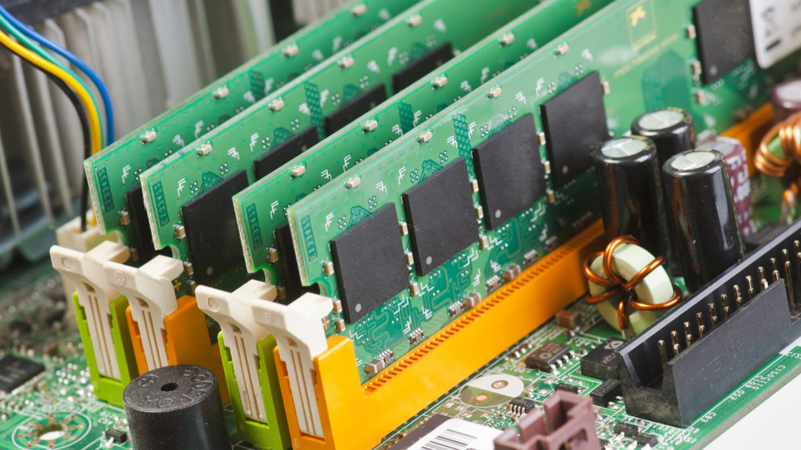
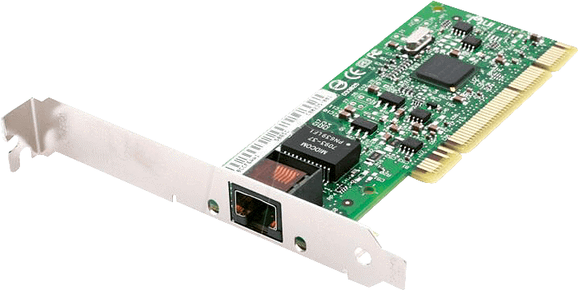

# What is Computer Science
"Computer Science is the study of computers and computational systems. Unlike electrical and computer engineers, computer scientists deal mostly with software and software systems; this includes their theory, design, development, and application.

Principal areas of study within Computer Science include artificial intelligence(facial recognition, perdictions), computer systems and networks (internet & communication), security (Cyber Security), database systems, human computer interaction (Siri), vision and graphics (games), numerical analysis, **programming languages**, **software engineering**, bioinformatics and theory of computing." `- (Dept of Computer Science at University of Marlyand)` 

In today's discussion we will talk about
- What are computers and how they work.
- What do we use computers for and how can we use them and
- What is programming and programming language 

Let's talk about Computers

## What are computers?

- A programmable device for processing, storing, and displaying information or 
- An electronic device that manipulates information (or data) using a combination of hardware and software or 

- Computers can be a `desktop computer`, `a laptop`, `a tablet`, `a cell phone`, `a smart watch` or a `game console` like `Playstation or Xbox`.

## What can you do with computers? With computers you can....
- Work on electronic documents, like create documents, presentations, spreadsheets and save them to a computer.
- Send emails
- Play desktop and online games.
  - The difference between desktop games vs online games are desktop games are games that are installed and run directly on your computer versus online games are games you play through a browser.

Computers depend on hardware and software. Without a computer is useless. 

Next let's talk about hardware and software...
## What is hardware?

### **`Hardware represents the physical components that are needed to run a computer, such as`**:

- Hardware comes in different flavors....

**`Memory`**: 

Memory is a place where programs and CPUs can store data for use later on.

**`CPU (Central Processing Unit)`**: 

CPUs are the brain where it picks up commands or tasks from memory to work on and\or complete. 
CPU and Memory work togeather to complete tasks given by users and\or applications.

**`Motherboard`**: 

Represents the backbone that ties the computer's components together at one spot and allows them to talk to each other. The mother board has placeholders for CPU, Memory, Hard Drives, Video and Network Cards and it make sures that everyone can tallk to each other.

**`Graphics Card and Integrated Graphics`**: 

Processes visual data such as movies, video games to a computer screen. 

If you're an online gammer, then you should understand the different types of graphic cards that are out in the market and how you can use them to improve the performance of your gaming experience.

**`NIC (Network Interface Card)`**: 

Provides internet to your computer. Every computer has one. Some have what's called an `Eithernet Port' and a Wifi attena and then others have a just a wifi card.

**`Hard Drives (HHD or SSD)`**:

Stores files and programs for long term storage.

**`Monitor`**: 

Provides a display for your apps\software\programs.

**`Power Supply`**: 

Provides power to your machine.

## What is software?
### **`Software tells a computer how to function`**. 
Software is made up of source code (or **commands**\instructions), written using a **programming language**, and then compiled into a program for end users to consume.

Software has other names like apps (or applications), scripts and programs.

Software runs on PCs, cell phones, tablest and other smart devices.

Here are some examples of common software\programs\apps (or software) that you will find on a computer:

| Software Components |
-------------
| Operating Systems: Windows, Linux or MacOS\IOS
|
|Office 365 - Microsoft Word, Excel, PowerPoint: used to created documents
|
| Email - Outlook, Gmail: used to send emails
||
| Video Games 
|
| Command Console - Command consoles: used to execute **commands** on a computer.
|

In the section we'll talk about `commands` and how use commands to create tasks for computers to complete.

## Quiz Time?

- What are computers ?

- Name two things you can do with a computer?

- What are some examples of computers? Give me two

- What is hardware and What is software?

- Is memory and cpu consider hardware or software?

- 'Madden 22' is that consider hardware or software?

# What are commands? 
Merriam-Webster defines command as 
- to give (someone) an order: to tell (someone) to do something in a forceful and often offical way or 
- to have authority and control over (a group of people, such as soliders)  or
- **`to give orders`** to **`execute`** as task, job,etc....

When we think about commands, what are some examples that come to your mind?
- A parent\gaurdian telling you `Clean your room`  or `Take the trash out` or `finish your homework`

Each of theses commands are translated into your mind as a task to complete or `execute`.

Computers work the same way. 

You give a command to a computer and it will `execute` your command, like sending emails or 

You might tell your computer how to complete (or `execute`) task. For example, you can tell a printer how you want your paper printed. You can tell it to print it in black and white or users colors. You can tell where to save your print outs or have it print it out onto a piece of paper.

So what does execute mean?
- To do or perform (an action or movement that requires skill)

In the case with computers, the computer uses software which either contains the specific skils needed to execute the task or has the capbility to learn a skill set that is required to execute a task.

For example:

Who knows what is an IPhone?
The IPhone is a smartphone made by Apple that combines a **computer**, IPod(transition into ITunes), digital camera and cellular phone into one device with a touchshreen interface.

IPhones are equiped with software that end users can use to **execute** specific **commands** on their phones. For example you can use an IPhone to make a call, play games, send text or emails or ask `Siri` a question.....

### What is Siri?
- Siri is a built-in voice-controlled personal assistant that's installed on your IPhone. 
- Siri is software program.
- You can ask Siri questions such as whats the time, whats the weather like, who won the ball game last night, or to make a phone call.

When you ask Siri a question, you're actually giving the computer, in this case an IPhone, a `command` to `execute`. 

Siri has the skilsets to answer most of your questions because Siri was designed and trained to listen and understand commands you give it and to return either a direct\relable answer or complete a task. 

In cases where Siri may not understand your command (or question or request), Siri will ask you to repeat your command or it may say that it does not understand your command.

Siri also has the capability to learn from you based on your phone activities. Such activities include adding new contacts, adding new music or games. It can suggest songs you might like or suggest favorite contacts...

As you complete these acitvities, Siri is learning more and more about you through your phone activity which in return will make Siri capable to answering your questions and to complete your requets.

Let's demostrate Siri: 

`[DEMO Siri - ask Siri who won the world series this year? Share with the class.]`

**How does Siri know who won the world series?**

Every day Siri is trained to crawl data on the web.

So any events, news or general information on the web, Siri gather data and stores into a location where it retrieve later to any your questions.

## Let's recap
- A computer is a electronic device that manipulates data
- A computer is made up of hardware and software conmponents.
- Hardware represents the physical components that allow computer to function.
- Sofware is program that a computer uses to accept commands and to execute tasks.
- Some example of computers are Laptops, tables, cell phones and game consoles.
- Commands, are orders or instructions that required a computer to execute. 
- Execute is the ability to perform an action that require skills to complete an action. This is handle mostly throught software
- Siri is a built in voice command and personal assistant for end uers to ask questions or to complete requests.

In the next section we will look into how we communicate with computers and how computers process information.

[Communicate with Computers](./Communicate_With_Computers.md)

