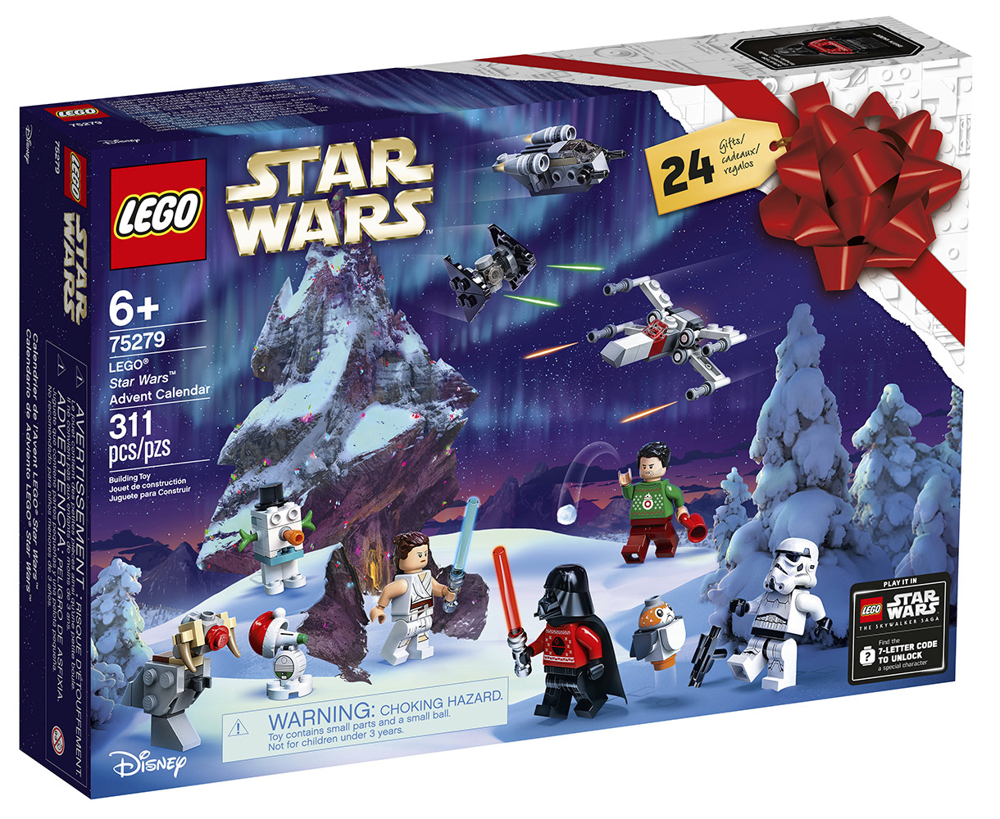
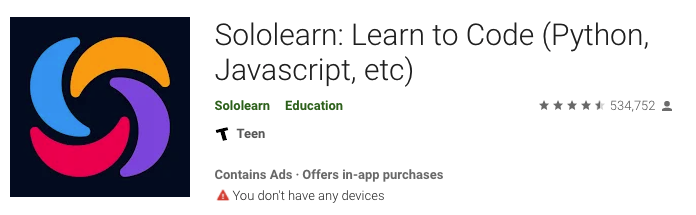
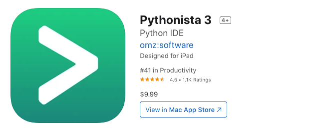
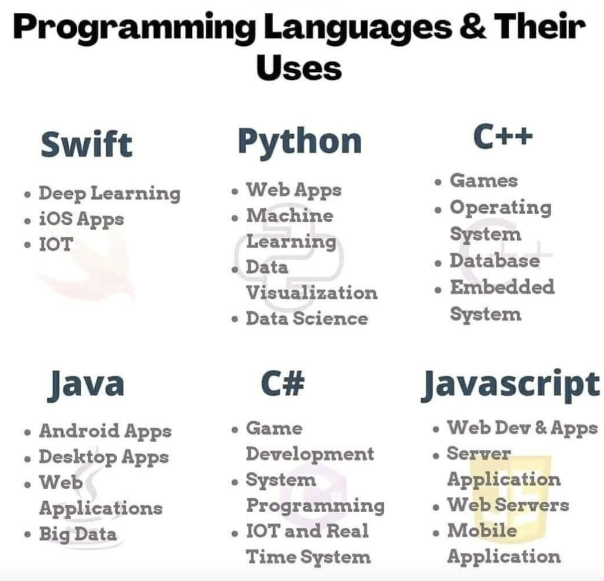
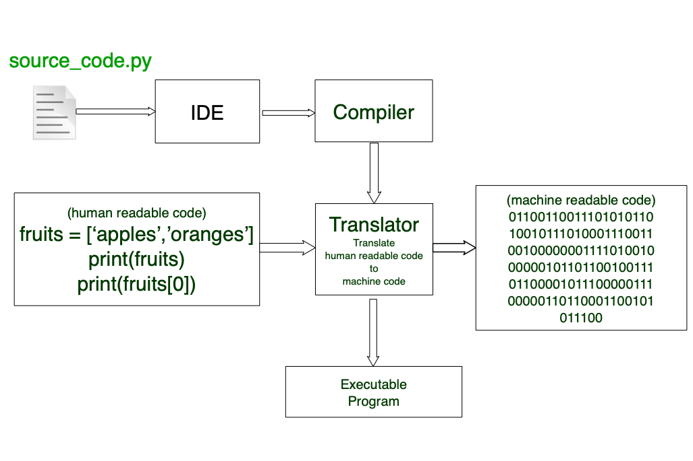

# Programming

In this section we will discuss programming and programming languages. 

We will begin with the `who`, `what`, `where` and `how` of `programming`.

## `What` is programming ?

`Programming` is the process of creating a set of instructions that tell the computer how to perform a task.

The person who writes the instructions is known as the `Developer`, `Software Developer`, `Programmer` or `Coder`.

The set of instructions to tell the computer how to perform a task is called `Source Code` or `Software Code`, or `Code`.

`Code` is written using a `programming language`.

`Programming` can be done using editor like Notepad or Microsoft Word or you can `IDE` or `Intergrade Development Environment`.

`IDEs` are software application that provides basic tools required to write and test software code.

`Software` is a collection of instructions packaged into a program for it to be executed by the end user.

Programming can be done using a variety of computer programming languages such as C#, JavaScript, Python, C++, etc...


We can think about programming like this....

Who remembers getting a lego set for christmas? A huge lego set, one with a manual with tons instructions.

[](/images/LegoImage.jpeg)

- A lego set comes with legos, stickers and a manual.
- The manual includes instructions on how to build the legoset.
- The `Source Code` is the manual.
- The `Programmer` is the author who created the manual.
- The `Computer` is you. As the computer you:
  - Read from the `Input`, which in this case is the `Source Code` or manual.
  - You build the legoset using `Memory` and `CPU` as resources to produce an `Output` or the desire results.
    - In human context, we're doing the same thing 
      - Reading and understanding the instructions from the manual.
      - Using our brain (as the `Memory` and `CPU`) to complete the task to our desire results.
### Why should we learning programming?

- I learned programming for the following reasons:
  1. I found it interesting that I could convert my thoughts into something a machine can produce, like figuring out the higest prime number.
  2. I knew it would take me from the couch that I slept on and the rat infested place that I was living in through high school and college and move me into my own place and then eventually to purchasing my first home.

- **Programming can be used to solved problems.**  
  - - Programmers solve a problem by breaking it down into workable pieces to understand it better. When you start learning to program, you develop the habit of working your way out in a very structured format. You analyze the problem and start thinking logically and this gives rise to more creative solutions you’ve ever given. (ref [Coding 101: Programming Language Building Blocks](https://hackernoon.com/
- Programming develops creative thinking. (ref [Coding 101: Programming Language Building Blocks](https://hackernoon.com/coding-101-programming-language-building-blocks-1w513uwe)
- Programming Provides Life-Changing Experiences (ref [Coding 101: Programming Language Building Blocks](https://hackernoon.com/coding-101-programming-language-building-blocks-1w513uwe)
coding-101-programming-language-building-blocks-1w513uwe))
- "Whether you want to uncover the secrets of the universe, or you just want to pursue a career in the 21st century, basic computer programming is an essential skill to learn." - Stephen Hawking
- "Everybody in this country should learn how to program a computer… because it teaches you how to think." - Steve Jobs

## `Who` can programming?
## Anyone......

## **YOU DO NOT HAVE TO BE SMART TO LEARN PROGRAMMING**

## **YOU DO NOT HAVE TO BE SMART TO WORK IN IT (OR INFORMATION TECHNOLOGY)**

## **YOU DO NOT HAVE TO BE SMART TO WORK WITH COMPUTERS**

Really anyone can learn how to program. 

As long as you're curious, you like solving problems and you have the ability to 'think out of the box', then thats all you need to get started.

## `Where` can you do programming?

Programming can be done on a computer, a tablet, or even your cell phones. Both the Apple and Google Play stores have apps you can install on your smart phone that will allow you to program on your phone.

For example:

SoloLearn (avaliable in both Apple and Google Play stores.) and Pythonista 3 (avaliable only in the Apple store) are apps where you can start learning to program through your phone.

  [](/images/SoloLearn.png)

  [](/images/SoloLearn.png)

  [](/images/SoloLearn.png)

For bigger projects,  you'll need a computer and software that is designed for developing games, websits and mobile apps.


## `How` do we get started with programming ?

 To get started programming you will need the following items:

 1. A computer with a editor or an IDE..Notepad is an example of an editor.


      [](./images/notepad.jpeg)

2. Choose a `programming language`. 
  - There's multiple programming languages that are designed for solve a specific problem or designed to solve multiple problems.
  - Programming languages come in the form of a package or executable file, that includes tools and resources required to write source code and to create programs from that specific programming language.

### Next lets talk about **Programming Languages**


## What is a programming language ?
[](/images/top-programming-languages.jpeg)
- Programming as the mental process of thinking up instructions to give to a machine to execute.

- `Coding` is the process of transforming those ideas into a written language that a computer can understand.

- Programming languages are human readable, meaning that humans can read code.

- Applying your instructions to a file and saving it using the correct file extension is called `source code`.
  - Why do we have the save the file using a specific file extension?
    - In general each program language has unique file extension(s) that it uses to build a program. We'll talk about more about later.  [Click here to read more about programming languages](https://www.codecademy.com/resources/blog/programming-languages)

- Not all programming languages are created the equal. 
  - Some are designed to solve a small range or problems while others were designed to solve a large range of problems. Look at the image below
    [](./images/notepad.jpeg)
  - Programming languages has their own set of rules on how to code in that language and how it builds programs. 
  - You can think of each program language as a actual language.
    - Each language has rules that define how to form senteces, questions, conversations, or when and how to uses words in a sentence. We call these rules 'Parts of Speech'. The same is true for programming languages, which we will see in the next section.
 

Let's discuss the building blocks (or Parts of Speech) of programming languages.

## The `building blocks` of a programming languages ? 

[Start From Here - read the articles below and include them into this section.]

https://betterprogramming.pub/building-blocks-programming-language-fundamentals-481ff296b477

What do you mean by building blocks? Let's think about the English language.
- The English language consists of nonus, verbs, adverbs, adjective, pronouns, prepositions, conjunctions and interjuctions. 
- These are called `Parts of Speech` which we use a a guide to write complete and comprehensive sentences.
- Programming languages has its own `Parts of Speech` concept which I will call `building block elements`. 
- These `building block elements` are a collection of rules that every language has that every developer follows in our to programs from their source code. 
- In addition we will also talk about object oriented programming concepts because Python is an object oriented programming language. 
- Alot of these rule are present in every programming language, but each language has adds their unique of creating things in thier owne specific language.

- In addition to programming language's `building block elements`, there's also concept that each language supports which is called `Programming Model`'.
- `Programming Models` is programming lanagues organize and designs how your write software. For example:
    - `Object oriented programming` is a programming model that organizes software design around data or objects rather than functions and logic. 
    - [`Functional programming`](https://www.infoworld.com/article/3613715/what-is-functional-programming-a-practical-guide.html) - using functions to the best effect for creating clean and maintainable software..
    - [`Structured or module programming`](https://searchsoftwarequality.techtarget.com/definition/structured-programming-modular-programming) - is a programming paradigm that facilitates the creation of programs with readable code and reusable components. 
 
Lets dive into the `building block elements`:[PICK UP FROM HERE]
  - `Syntax`: 
    - This tells us the rules of how to write code in a specific language. 
    - Similar to writing sentences in the English, we must have the following: 
      - A sentence must begin with a captial letter and end with a punctuation mark.
      - A sentence must contain a subject, a predicate and complete thought.
    - The same is true for a programming language. The syntax for a programming language is part of the documentation that comes with any programming language. 
  - `Semantics`: 
    - Defines the effect\meaning the instructions have(logic). 
    - This defines the understanding of your source code.  
  - `Data Types`: 
    - Defines the classification of data we want to store in memory.
    - We can think of data types as a way to define a number or text in a programming language. 
      - For example: 
        - We can define `1` as an integer data type because it represents a number. 
        - We can define `3.4` as a decimal data type because it represents a number with a decimal.
        - We can define `test` as a string data type because it represents text.
        - There's more data types outside of intergers, decimal and strings, which we will learn later on.
        - Now there's one more data type we need to know  and its important to know...This special data type is called `object`. 
        - An `object` data type is a 'catch all' for all data types. All data types inherit from an object data type. Intergers, Decimal, String are the children of an `object` data type, they inherit all the *qualities* or characteristics of an object data type.
  - `Terms:`
    - These are commonly used buzzwords we use to describe a piece of code, such as Paramters, Keywords Variables, Expressions, Statements, Functions, Classes and many more. 
    - `Literals`:
      - Is a programming is a piece of text that represents a fixed value in source code. Examples of literals:
      ```python
      123    # an interger literal
      1.23   # a floating point literal
      'test' # a string literal 
      # a boolean literal - Boolean is a data type that defines two values: True or False
      x = True  
      a = { x: 1, y: 2} # an object literal.
      ```
    - `Operators`:
      - Its a symbol that tells the compiler (or interpreter) to perform a mathematical, logical, relational or other operation as defined in the language specification.
      - For example:
        - Common operators: 
          - arithmetic: +(plus), - (minus), *( multiply), / (divide)
          - assignment: = (equals)
          - logic: !(NOT), && (AND), || (OR)
          - equality testing: ==, !=
          - function call: ()
          - increment / decrement: ++, --
          - member selection: .
          - order relations: <(less than), <= (less than or equal), > (greater than), >= (greater than or equal)
        - An operator can also be a word. For example `sizeof` is an operator in the C language  which returns  the storage created for a given data type.
        - An operator that takes one argument is called *unary operator*. For example: 
        ```python
            a++ # unary operator
        ```
        - An operator that takes two arguments is called a *binary operator*. For example: 
        ```python
          a+b # a binary operator
        ```
    - `Statements`:
      - Is a unit of executable code that does not return a value. 
      - Statements may contain a mixture of variables, operators, literals and other keywords (keywords are words that serve one specific purpose and cannot be used in any other way defined by the programming language).
      - For example:
      ``` python
      # Simple statements
      a = 10 # variable a
      b = 9 # variable b
      a = b # We are assigning the value of variable b to the value of variable a. In case we are overridding the value. 
      # Return statement
      return a # returns the value of variable a.
      # if statements
      if(a < b) return c:
      # loop statements
      for a in numbers { 
        print(a) 
      }
      # switch statements
      fruit = 'Banana'
      if fruit == 'Mango': 
          print("letter is Mango") 
      elif fruit == "Grapes": 
          print("letter is Grapes") 
      elif fruit == "Banana": 
          print("fruit is Banana") 
      else: 
          print("fruit isn't Banana, Mango or Grapes") 
      ```
    - `Expressions`:
      - A unit of executable code that returns a value.
      - Examples are:
      ```python
        1 + 2 # uses the binary operator to return the value 3
        a * b # uses the '*' operator and returning a multiplied by b
        !a    # uses the unary operator and returns a boolean value (false)
        # Expressions and statements can be combined
        a = b + c # this statement says take the binary operator '+' and add the value of variable 'b' and 'c' and then assign the value to variable 'a' 
        # b + c is an expression
        # a = b + c is a statement.
      ```
    - `Operator Precedence and Associativity`:
      - Is the set of rules that determines in what order operators are applied within a complex expression.
      ``` python
      (2 -1 ? 0 : 1) == 0 # this expression and statement says:
      # 1. subtract '1' from 2'
      # 2. '?/ represents the if statement. If 2-1 is equal to '0' (defined by '== 0).
      # If 2-1 is equal to 0, then return '0' else return '1'
      ```
    - `Functions\Methods`:
      - Its a reusable block of code that performs a specific task.
      - Example:
      ``` python
        # AddTwoNumbers is a block of code that will add two numbers and return it to its caller.
        # This is one of the ways how functions are defined in Python.
        def AddTwoNumbers(A, B): 
            return A+B
        print(AddTwoNumbers(1,2)) # print() is also a function that display data to a screen.
      ```
    - `Properties or Attributes`:
      - Represents the characteristics of an object. 
      - An object can be car, person, house, etc.....The properties (or attributes) represents the color of the house or the model of the car or age of a person. These are details that describes the details about the object. 
    - `Class`:
      - Is a blueprint for that defines the properties and functions common to all objects of a certain kind.
      - We can think a class like a Human
      ``` python
       class Human:
         # These are properties of a car object or the characteristics of a car. 
         name: str
         email: str
         address: str
         age: int
         def __init__(self, Name, Email, Address, Age): # this is called a constructor
             # A constructor is a special function that prepares the object to be used within your code. Its called when you're ready to create object in your code.
             self.name = Name
             self.email = Email
             self.address = Address
             self.wheelSize = WheelSize
             self.age = Age


         def VerifyIdentity(Name, Address, Age):
             # This function verifies the identity of the person.
             if(self.name == Name && self.address == Address && self.age == Age):
                return True
             else:
                return False
         
         def SendEmail(Email):
             # This function sends an email based on the email value provided.
             SendEmailFromGoogle(Email)
             return True

        # Here is how to create a Human object in memory.
        # When the Human object is created, the __init__() method is called to prepare the object to be used.
        newHuman = Human('Brandon Hunter','bhunter@gmail.com', '5555 Apple Drive, Oil City, MA 29123', 40 ) 
        IsSamePerson = newHuman.VerifyIdentity('Brandon Black','',34)
        if(IsSamePerson == True):
           print("Hi Brandon")
        else:
           print("You're not Brandon")
             
      ```

  - `Data Structures:` 
    - Data structures are objects where we can store, organize and retrieve data. Examples are lists, arrays, matries, tables,etc....
    ``` python
    # this is an example of a list in Python
    fruits = ["apple", "banana", "cherry"]
    print(fruits[0]) # prints 'apple'

    # this is an example of a dictionary. It stores data in a key:value paris.
    car = { "brand": "Ford", "model": "Mustang", "year": 1964 }
    print(car["brand"]) # prints 'Ford'
    ```
   
  - `Algorithms:` 
    - An algorithm is a step-by-step procedure to solve any computational problem. For example Fibonacci Sequence is a sequence of numbers and the next number is found by adding the two numbers before it. 
    ``` python
    # Program to display the Fibonacci sequence up to n-th term
    nterms = int(input("How many terms? "))

    # first two terms
    n1, n2 = 0, 1
    count = 0

    # check if the number of terms is valid
    if nterms <= 0:
       print("Please enter a positive integer")
    # if there is only one term, return n1
    elif nterms == 1:
         print("Fibonacci sequence upto",nterms,":")
         print(n1)
    # generate fibonacci sequence
    else:
        print("Fibonacci sequence:")
        while count < nterms:
              print(n1)
              nth = n1 + n2
              # update values
              n1 = n2
              n2 = nth
              count += 1
    ```
  - `Compilers`:
     - A compiler is a computer program that translate your source code into a machine-readable language for the computer to execute.
     - Basically its a translator.
     - Remember in the previous section computers speak in 1's and 0's or binrary. In order for you to run your code on your computer, we need a translator to translate your instructions (or source code) into a language that a computer understands in order for the computer to execute your instructions (or source code). After our break we will look into how programs are created and how can they run on computers.
## Lets take a 10 minute break

## How are programs created

### `What are Compilers (or Interpers)?`
Compiler is a program that translate `human readable code` into a `machine readable code` for the computer to execute.

`machine readable code` is binary code. Lets look at an example of how text and numbers are translated in to binary code.
- [DEMO: Convert To Binary Code (Python)](demos/convert_to_binary.py)

Each programming language has its compiler that is designed to read its own source code and translate the source code into machine code. 

Some programming languages has more than one compiler.

Most compilers are designed on different operating systems and different processor models such as Windows, Mac OS or Linux.

There are some compilers that only work on specifically one or two operating systems such as XCode. **_XCode is a programming language used to create apps for Apple products._**

Let's use the visualization below to walk through high level overview of how the compiler works:

[](/images/CompilerWorkflow.png)

Lets say you're writing a python script to turn on the lights in your house.

You write your code in your IDE (Intergrated Development Environment) or an editor, and then you save youyr changes using the apporiate file extension, in this case its `py`. 

`Why would you have to save the file with the .py file extension?` Since we're writing a script using Python, the Python's compiler looks for files with that file extension. Once the compiler finds that file, then compiler begins compling process. Every programming languages has a similar process.

Afte saving your changes, then you click the a run or `play` button within your IDE to start the compiler. 

During this time the compiler is doing the following:
    
- Reads your code and tries to figure out the words within your source code.` 

- Next, the compiler verifies the grammar (or syntax) in your source code by organizing your source code into `parse tree`.

- Next, the compiler records all the variables, functions and classes (and other related items) that the computer needs to keep track in your program.

- Then finally the compiler `traverses` the tree and figures identifies which machine code that would effectly do the same thing as your source code. This is the part where it translate your code into machine code. 
    
  - *Note - there's a little more that goes on before the source code is compiled into machine code.*

- If the compiler reports no errors with your code, then the compiler completes the process by creating an executalbe program that you can run on your computer.

- If errors are found, by the compiler, within your source code, meaning mispelling of words or the incorrect use of a keyword or other errors, then the compiler will stop and return the errors back to your IDE. 
   
One more thing we need to discuss before we end this section. Compilers vs Interpreters.

Programming languages are also divided into compiler languages vs interpreter languages.

Here's the difference:

- Compilers take the entire source code, translate the source code into binary code (or object code) then the code can be directly executed by the computer.

- Interpreters translate your souce code line by line when you run the program. Python is consider and interpreter language because it uses an interpreter to run your source code.

- `Which one do you think runs slower?` The compiler or the interpreter.
  

## Lets Recap
- We discuss what is programming. `Programming is ?` It's the mental process of thinking up instructions to give to a machine (like a computer).
- We discussed who can program...Anyone all you need is a computer with an editor (IDE) and install the necessary software to code and compile in the programming language you select.
- We discussed some concepts of programming such syntax, semantics, terms such as literals, expressions, variables, data types functions and classes, and then data structures, alogrithims and then compilers.
- We discussed compilers, what they are and how they work from high level point of view.


For those that are curious provided below are some resources that goes over what we reviewed today in further details. Check them out when you get a chance.

- [Compiler vs. Interpreter: Know The Difference And When To Use Each Of Them](https://betterprogramming.pub/compiler-vs-interpreter-d0a12ca1c1b6)
- [How do computers read code ?](https://www.youtube.com/watch?v=QXjU9qTsYCc)

- [Computer Science 101 - YouTube Series](https://www.youtube.com/playlist?list=PL8dPuuaLjXtNlUrzyH5r6jN9ulIgZBpdo)

## In next class we will start learning about Python and this guy.

[Guido van Rossum](https://gvanrossum.github.io/)

