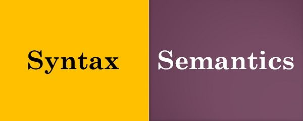

# Programming

In this section we will discuss programming and programming languages. 

We will begin with the `who`, `what`, `where` and `how` of `programming`.

## `What` is programming ?

`Programming` is the process of creating a set of instructions that tell the computer how to perform a task.

The person who writes the instructions is known as the `Developer`, `Software Developer`, `Programmer` or `Coder`.

The set of instructions to tell the computer how to perform a task is called `Source Code` or `Software Code`, or `Code`.

`Code` is written using a `programming language`.

`Programming` can be done using editor like Notepad or Microsoft Word or you can `IDE` or `Intergrade Development Environment`.

`IDEs` are software application that provides basic tools required to write and test software code.

`Software` is a collection of instructions packaged into a program for it to be executed by the end user.

Programming can be done using a variety of computer programming languages such as C#, JavaScript, Python, C++, etc...


We can think about programming like this....

Who remembers getting a lego set for christmas? A huge lego set, one with a manual with tons instructions.

[](/images/LegoImage.jpeg)

- A lego set comes with legos, stickers and a manual.
- The manual includes instructions on how to build the legoset.
- The `Source Code` is the manual.
- The `Programmer` is the author who created the manual.
- The `Computer` is you. As the computer you:
  - Read from the `Input`, which in this case is the `Source Code` or manual.
  - You build the legoset using `Memory` and `CPU` as resources to produce an `Output` or the desire results.
    - In human context, we're doing the same thing 
      - Reading and understanding the instructions from the manual.
      - Using our brain (as the `Memory` and `CPU`) to complete the task to our desire results.
### Why should we learning programming?

- I learned programming for the following reasons:
  1. I found it interesting that I could convert my thoughts into something a machine can produce, like figuring out the higest prime number.
  2. I knew it would take me from the couch that I slept on and the rat infested place that I was living in through high school and college and move me into my own place and then eventually to purchasing my first home.

- **Programming can be used to solved problems.**  
  - - Programmers solve a problem by breaking it down into workable pieces to understand it better. When you start learning to program, you develop the habit of working your way out in a very structured format. You analyze the problem and start thinking logically and this gives rise to more creative solutions you’ve ever given. (ref [Coding 101: Programming Language Building Blocks](https://hackernoon.com/
- Programming develops creative thinking. (ref [Coding 101: Programming Language Building Blocks](https://hackernoon.com/coding-101-programming-language-building-blocks-1w513uwe)
- Programming Provides Life-Changing Experiences (ref [Coding 101: Programming Language Building Blocks](https://hackernoon.com/coding-101-programming-language-building-blocks-1w513uwe)
coding-101-programming-language-building-blocks-1w513uwe))
- "Whether you want to uncover the secrets of the universe, or you just want to pursue a career in the 21st century, basic computer programming is an essential skill to learn." - Stephen Hawking
- "Everybody in this country should learn how to program a computer… because it teaches you how to think." - Steve Jobs

## `Who` can programming?
## Anyone......

## **YOU DO NOT HAVE TO BE SMART TO LEARN PROGRAMMING**

## **YOU DO NOT HAVE TO BE SMART TO WORK IN IT (OR INFORMATION TECHNOLOGY)**

## **YOU DO NOT HAVE TO BE SMART TO WORK WITH COMPUTERS**

Really anyone can learn how to program. 

As long as you're curious, you like solving problems and you have the ability to 'think out of the box', then thats all you need to get started.

## `Where` can you do programming?

Programming can be done on a computer, a tablet, or even your cell phones. Both the Apple and Google Play stores have apps you can install on your smart phone that will allow you to program on your phone.

For example:

SoloLearn (avaliable in both Apple and Google Play stores.) and Pythonista 3 (avaliable only in the Apple store) are apps where you can start learning to program through your phone.

  [](/images/SoloLearn.png)

  [](/images/SoloLearn.png)

  [](/images/SoloLearn.png)

For bigger projects,  you'll need a computer and software that is designed for developing games, websits and mobile apps.


## `How` do we get started with programming ?

 To get started programming you will need the following items:

 1. A computer with a editor or an IDE..Notepad is an example of an editor.


      [](./images/notepad.jpeg)

2. Choose a `programming language`. 
  - There's multiple programming languages that are designed for solve a specific problem or designed to solve multiple problems.
  - Programming languages come in the form of a package or executable file, that includes tools and resources required to write source code and to create programs from that specific programming language.

### Next lets talk about **Programming Languages**


## What is a programming language ?
[](/images/top-programming-languages.jpeg)
- Programming as the mental process of thinking up instructions to give to a machine to execute.

- `Coding` is the process of transforming those ideas into a written language that a computer can understand.

- Programming languages are human readable, meaning that humans can read code.

- Applying your instructions to a file and saving it using the correct file extension is called `source code`.
  - Why do we have the save the file using a specific file extension?
    - In general each program language has unique file extension(s) that it uses to build a program. We'll talk about more about later.  [Click here to read more about programming languages](https://www.codecademy.com/resources/blog/programming-languages)

- Not all programming languages are created the equal. 
  - Some are designed to solve a small range or problems while others were designed to solve a large range of problems. Look at the image below
    [](./images/notepad.jpeg)
  - Programming languages has their own set of rules on how to code in that language and how it builds programs. 
  - You can think of each program language as a actual language.
    - Each language has rules that define how to form senteces, questions, conversations, or when and how to uses words in a sentence. We call these rules 'Parts of Speech'. The same is true for programming languages, which we will see in the next section.
 

Let's discuss the building blocks (or Parts of Speech) of programming languages.

## The `building blocks` of a programming languages ? 

[Start From Here - read the articles below and include them into this section.]

https://betterprogramming.pub/building-blocks-programming-language-fundamentals-481ff296b477

What do you mean by building blocks? Let's think about the English language.
- The English language consists of nonus, verbs, adverbs, adjective, pronouns, prepositions, conjunctions and interjuctions. 
- These are called `Parts of Speech` which we use a a guide to write complete and comprehensive sentences.
- Programming languages has its own `Parts of Speech` concept which I will call `building block elements`. 
- These `building block elements` are a collection of rules that every language has that every developer follows in our to programs from their source code. 
- In addition we will also talk about object oriented programming concepts because Python is an object oriented programming language. 
- Alot of these rule are present in every programming language, but each language has adds their unique of creating things in thier owne specific language.

- In addition to programming language's `building block elements`, there's also concept that each language supports which is called `Programming Model`'.
- `Programming Models` is programming lanagues organize and designs how your write software. For example:
    - `Object oriented programming` is a programming model that organizes software design around data or objects rather than functions and logic. 
    - [`Functional programming`](https://www.infoworld.com/article/3613715/what-is-functional-programming-a-practical-guide.html) - using functions to the best effect for creating clean and maintainable software..
    - [`Structured or module programming`](https://searchsoftwarequality.techtarget.com/definition/structured-programming-modular-programming) - is a programming paradigm that facilitates the creation of programs with readable code and reusable components. 
 
Lets dive into the `building block elements`:

[](./images/syntax_semantics.jpeg)

  - `Syntax`: 
    - This tells us the rules of how to write code in a specific language. 
    - Think about some of the rules of our English language:
      - Every sentence ends with a punctuation mark like '.', '?' or '!'
      - A sentence must begin with a captial letter.
    - Same is true for programming languages, for example
      - Variables are containers (or objects) we use to store a value that we can use within our source code.
      - In Python we define variables like this: 
      ```python
        age = 4 # age is a variable that saves a numeric value.
      ```
  - `Semantics`: 
    - Defines the effect\meaning the instructions have(logic). 
    - This defines the understanding of your source code.
    - Why is this important? In order to create a program, the program language must understand your instructions and it does this by breaking down each `term` you use and analyze what you're trying to do and then execute it. In order to get that complete understanding you must use the programming language's correct syntax and write source code that the programming language understands how to execute your instructions. For example:
    ``` python
    # This will fail because the programming language does not understand how to process your instructions
    age = 23/0*@ 

    # This will fail, not becuase the programming language does not understand how to process your instructions, but if will fail because you cannot divided any number of by 0 
    age = 20/0 

    # This will pass because you're using the correct syntax and the programming language understands how to process your instructions.
    age = 20/4
    ```
    *Note the `programming language` in this context represents a `compiler`. A compiler is a special program, that every programming language has, that converts your instructions (or source code) into machine code in order to create an executable program. We will talk about this later in this section.* 

  [](./images/DataTypes.jpg)  
  - `Data Types`: 
    - A data type is a classification of data which tells the compiler or interpreter how the programmer intends to use the data. (By Rebus Community [PROGRAMMING FUNDAMENTALS](https://press.rebus.community/programmingfundamentals/chapter/data-types/))
    - We can think of data types as a way to define a number or text in a programming language. 
      - For example: 
        - We can define `1` as an integer data type because it represents a number. 
        - We can define `3.4` as a decimal data type because it represents a number with a decimal.
        - We can define `test` as a string data type because it represents text and so on...
      - Data types are important every program, but choosing the correct data types in your program is extermely important especially in the banking, travel and scientific industries. Why?
      
      - Data types are declare on a variable and in most programming languages they are required, while other programming languages do not require you to declare a data type for your variables.
      - `Object` is a special data type. 
      - `Objects` are nonuns.
      - Why? `Object` is the 'catch all' for all data types. Everything created in your source code was created using the `Object` data type.
        - You can think of `Objects` in the programming world as the parent for all data types used in your program.
        - The data type objects are mainled used when we do not know the data type of the value we are receving from another program. For example:
        ``` C#

        int age = 23 // C# you are required to declare a data type for any variable you crated. In this case the C# compiler will recongize this variable as an interger data type.
        var newAge = 24 // C# - the var data type tells the compiler to figure out the variable's data type. In this case its an interger.
        ``` 
        ``` python
        age = 23 # Python  - will figure out the variables data type.
        ```
      - Data types also takes up space in memory. When you declare a type to variable or just create a variable, then that variable takes up space in memory.
      - Each data type is associated with a size and range
        - The size represents the 'unit of memory' or how much space it takes up in memory and 
        - The range represents the min and max values that the data type can accept. 
        - Using the table below you can see the Size (Bit/Bytes) and Range for each data types.
      
          [](./images/DataTypes.png)  

        - ## Let's talk about bytes for a second......

          - Remember our conversation about `Units of Memory`???????

          - `Units of Memory` is the amount of data that memory can hold. 

          - Here are the different `Units of Memory` types:

            - `Bit` - the smallest unit of representation in the binary language. 
              - A `bit` can be represented as a 1 or 0.
            - `Nibble` 
              - Is a collection of 4 bits.
              - Examples: 0000,0001,0010,0011,0100,0101,0110,0111,1000,1001,1010,1011,1100,1101,1110,1111
            - `Byte`: 
              - Is a group of 8 bits.
              - This can represent any word, symbol or character.
            - `Kilobyte (KB)`
              - Represents 1024 bytes or 2^10 
              - Megabytes usually measures the size of text documents, graphics of websites, individual files, etc.
            - `Megabyte (MB)`
              - Represents 1,048,576 bytes or 2^20.
              - Some examples are high-resolution images, songs,etc..
            - `Gigabyte (GB)`
              - Represents 1,073,741,824 bytes or 2^30.
              - Most mondern day memory sticks and storage drives supports GB sizes.
            - `Terabyte (TB)`
              - Represents 1,099,511,627,776 bytes or 2^40.
            - `Petabyte (PB)`
              - Represents 1,125,899,906,842,624 bytes or 2^50 
              - Typically used in large computer networks or servers in large companies such as Google and Facebook.
              - Google, Facebook, Microsoft and Amazon store at least 1200 petabytes of information.
            - `Exabyte (EB)`
              - Represents 1,152,921,504,606,846,976 bytes or 2^60.
              - Exabytes are used to measure the sum of multiple storage networks or the amount of data transferred over the Internet in a certain amount of time.
              - By 2025 463 exabytes of data will be generated each day by people (Source: Raconteur)
            - `Zettabyte (ZB)`
              - Represents 1,180,591,620,717,411,303,424 bytes or 2^70
              - 2018 it was reported the total of all data created, catpured or replicated reached 18 ZB.
              - By 2025 the world's data will group to 175 ZB
            - `Yottabyte (YB)`
              - Represents 1,208,925,819,614,629,174,706,176 bytes or 20^80
              - It is a tremendously huge unit of measurement. Therefore, it has no practical use.
      
  - `Literals`:
    - Its a piece of text that represents a fixed value in source code. Examples of literals:
    ```python
    123    # an interger literal
    1.23   # a floating point literal
    'test' # a string literal 
    # a boolean literal - Boolean is a data type that defines two values: True or False
    x = True  
    a = { x: 1, y: 2} # an object literal.
    ```
  - `Operators`:
    - Its a symbol that tells the compiler (or interpreter) to perform a mathematical, logical, relational or other operation as defined in the language specification.
    - For example:
      - Common operators: 
        - arithmetic: +(plus), - (minus), *( multiply), / (divide)
        - assignment: = (equals)
        - logic: !(NOT), && (AND), || (OR)
        - equality testing: ==, !=
        - function call: ()
        - increment / decrement: ++, --
        - member selection: .
        - order relations: <(less than), <= (less than or equal), > (greater than), >= (greater than or equal)
      - An operator can also be a word. For example `sizeof` is an operator in the C language  which returns  the storage created for a given data type.
      - An operator that takes one argument is called *unary operator*. For example: 
      ```python
          a++ # unary operator or an operation with only one operand.
      ```
      - An operator that takes two arguments is called a *binary operator*. For example: 
      ```python
        a+b # a binary operator or an operatin with two operands.
      ```
  - `Statements`:
    - Is a unit of executable code that does not return a value. 
    - Statements may contain a mixture of variables, operators, literals and other keywords (keywords are words that serve one specific purpose and cannot be used in any other way defined by the programming language).For example:
      ``` python
      # Simple statements
      a = 10 # variable a
      b = a # We are assigning the value of variable a to varaible b.
      
      return a # returns the value of variable a to the caller.
      # if statements
      if(a < b) return c:
      # loop statements
      for a in numbers { 
        print(a) 
      }
      # switch statements
      fruit = 'Banana'
      if fruit == 'Mango': 
          print("letter is Mango") 
      elif fruit == "Grapes": 
          print("letter is Grapes") 
      elif fruit == "Banana": 
          print("fruit is Banana") 
      else: 
          print("fruit isn't Banana, Mango or Grapes") 
      ```
    - `Expressions`:
      - A unit of executable code that returns a value.
      - Examples are:
      ```python
        1 + 2 # uses the binary operator to return the value 3
        a * b # uses the '*' operator and returning a multiplied by b
        !a    # uses the unary operator and returns a boolean value (false)

        # Expressions and statements can be combined
        a = b + c # this statement says take the binary operator '+' and add the value of variable 'b' and 'c' and then assign the value to variable 'a' 
        # b + c is an expression
        # a = b + c is a statement.
      ```
  - `Operator Precedence and Associativity` or `Order of Operations`:
    - Is the set of rules that determines in what order operators are applied within a complex expression.
    ``` python
    (2 -1 ? 0 : 1) == 0 # this expression and statement says:
    # 1. subtract '1' from 2'
    # 2. '?/ represents the if statement. If 2-1 is equal to '0' (defined by '== 0').
    # If 2-1 is equal to 0, then return '0' else return '1'
    ```
  - `Functions\Methods`:
    - Its a reusable block of code that performs a specific task.
    - They're Verbs or Actions
    - Example:
    ``` python
      # AddTwoNumbers is a block of code that will add two numbers and return it to its caller.
      # This is one of the ways how functions are defined in Python.
      def AddTwoNumbers(A, B): 
          return A+B
      print(AddTwoNumbers(1,2)) # print() is also a function that display data to a screen.
    ```
  - `Properties or Attributes`:
    - Represents the characteristics of an object. An object can be car, person or house and the properties represents the person's color, or the color of the car or the height of an house. These are details that describes the details about the object. 
  - `Class`:
    - Is a blueprint for that defines the properties and functions common of an object.
    - We can think a class like a Human
    ``` python
      class Human:
        # These are properties of a car object or the characteristics of a car. 
        name: str
        email: str
        address: str
        age: int
        def __init__(self, Name, Email, Address, Age): # this is called a constructor
            # A constructor is a special function that prepares the object to be used within your code. Its called when you're ready to create object in your code.
            self.name = Name
            self.email = Email
            self.address = Address
            self.wheelSize = WheelSize
            self.age = Age


        def VerifyIdentity(Name, Address, Age):
            # This function verifies the identity of the person.
            if(self.name == Name && self.address == Address && self.age == Age):
              return True
            else:
              return False
        
        def SendEmail(Email):
            # This function sends an email based on the email value provided.
            SendEmailFromGoogle(Email)
            return True

      # Here is how to create a Human object in memory.
      # When the Human object is created, the __init__() method is called to prepare the object to be used.
      newHuman = Human('Brandon Hunter','bhunter@gmail.com', '5555 Apple Drive, Oil City, MA 29123', 40 ) 
      IsSamePerson = newHuman.VerifyIdentity('Brandon Black','',34)
      if(IsSamePerson == True):
          print("Hi Brandon")
      else:
          print("You're not Brandon")
            
    ```
   [Code Example](https://colab.research.google.com/drive/1aAAyDfMa3VinTgD7r4SRzk8qBW-HJz8k?usp=sharing)
  - `Data Structures:`
    - Data structures are objects where we can store, organize and retrieve data. Examples are lists, arrays, matries, tables,etc....
      ``` python
      # this is an example of a list in Python
      fruits = ["apple", "banana", "cherry"]
      print(fruits[0]) # prints 'apple'

      # this is an example of a dictionary. It stores data in a key:value paris.
      car = { "brand": "Ford", "model": "Mustang", "year": 1964 }
      print(car["brand"]) # prints 'Ford'
      ```
   
  - `Algorithms:` 
    - A set of instructions for solving a problem or accomplishing a task.
    - For example Fibonacci Sequence, an alogrithm, is a sequence of numbers and the next number is found by adding the two numbers before it. 
      ``` python
      # Program to display the Fibonacci sequence up to n-th term
      nterms = int(input("How many terms? "))

      # first two terms
      n1, n2 = 0, 1
      count = 0

      # check if the number of terms is valid
      if nterms <= 0:
        print("Please enter a positive integer")
      # if there is only one term, return n1
      elif nterms == 1:
          print("Fibonacci sequence upto",nterms,":")
          print(n1)
      # generate fibonacci sequence
      else:
          print("Fibonacci sequence:")
          while count < nterms:
                print(n1)
                nth = n1 + n2
                # update values
                n1 = n2
                n2 = nth
                count += 1
      ```
  - `Errors`
    - Errors are issues in your code that causes your program crash or causes your program to output an incorrect result. Errors are broken out into 3 different areas:
      - Syntax Errors - these errors are caused by using incorrect syntax in your code base.
      ``` python
        # This code won't run at all because its missing ':' after the 'y' within the if statement.
        x = 206
        y = 42
        if x < y
          print(str(x) + ' is greater than ' + str(y))
      ```
      - Runtime Errors - these errors occur when the program identiifes an issue that it doesn't know how to handle or solve the issue, like losing a database connection or accessing a deleted file or user does not have enough permission.
      - Logical Errors - these errors occur when the logic is faulty in your code meaning:
      ``` python
      # This code won't run at all because x will never be less than y.
      x = 206
      y = 42
      if x < y:
         print(str(x) + ' is greater than ' + str(y))
      ```
    - We'll talk more about `Errors` once we start programming.
  - `Debugging`:
    - Is the process of locating and removing **bugs** from your program.
      - What are **bugs** ? Bugs are errors in your code that makes your program fail or do unexpected things.
      - Example of bugs: a glitch in a computer game, or a program consistently returning incorrect values,etc...
  - `Compilers`:
     - Are translators that takes your source code and translate your code into binary code for the computer to execute.
     - A compiler is a computer program that translate your source code into a machine-readable language for the computer to execute.
     - The action that takes your source code, inspect your source code and if there are no issues, produces a program or reports back errors, is called `compile`. 
     - `Compile` checks for syntax errors mainly....We'll talk more about this topic once we started with programming.
     - Basically its a translator that takes your source code and translate your code into binary code for the computer to execute.
     - After our break we will look into how programs are created and how can they run on computers.
## Lets take a 10 minute break

## How are programs created

### `What are Compilers (or Interpreter)?`
Compiler is a program that translate `human readable code` into a `machine readable code` for the computer to execute.

Interpreters are a little different than compilers where the source is translated into `bytecode` by the interpreter and the interpreter translate the `bytecode` into `machine code`.

`machine readable code` is binary code. Lets look at an example of how text and numbers are translated in to binary code.
- [DEMO: Convert To Binary Code (Python)](demos/convert_to_binary.py)

Every programming language is equiped with its own compiler or interpreter that is designed to compile source code, to produce a program.


Most compilers are designed to be used on different operating systems and different processor models such as Windows, Mac OS or Linux.

There are some compilers only work on specifically one or two operating systems such as XCode. **_XCode is a programming language used to create apps for Apple products._**

Let's use the visualization below to walk through high level overview of how the compiler works:

[](/images/CompilerWorkflow.png)

Lets say you're writing a python script to turn on the lights in your house.

You write your code in your IDE (Intergrated Development Environment) or an editor, and then you save your changes using the `.py` file extension. 

`Why would you have to save the file with the .py file extension?` Since we're writing a script using Python, the Python's compiler looks for files with that file extension. Once the compiler finds that file, then the compiler begins  the compling process. Every programming languages has a similar process.

Afte saving your changes, then you click the a run or `play` button within your IDE to start the compiler. 

During this time the compiler is doing the following:
    
- Reads your code and tries to figure out the words within your source code.` 

- Next, the compiler verifies the grammar (or syntax) in your source code by organizing your source code into a `parse tree`.

- Next, the compiler records all the variables, functions and classes (and other related items) that the computer needs to keep track in your program.

- Then finally the compiler `traverses` the tree and identifies which machine code that would effectly do the same thing as your source code. This is the part where it translate your code into machine code. 
    
  - *Note - there's a little more that goes on before the source code is compiled into machine code.*

- If the compiler does not identify any errors with your code, then the compiler completes the process by either 
  - Creating an executalbe program that you can run on your computer or 
  - Running your program automatically.

- If errors are found, by the compiler, within your source code, meaning mispelling of words or the incorrect use of a keyword or other errors, then the compiler will stop and return the errors back to your IDE. 
   
## Lets Recap
- We discussed 
  - What is programming..... `Programming is` the mental process of thinking up instructions to give to a machine (like a computer).
  - Who can programm.....Anyone....
  - How can we get started with programming.....An editor like notepad or development editor like visual code and select a program language you want to learn and get started.
  - `Building Blocks` of programming which include topics such as syntax, semantics, literals, expressions, varaibles, data types, errors, debugging, compilers and more...
  - Finished with compilers and interpreters and how they work.....

For those that are curious provided below are some resources that goes over what we reviewed today in further details. Check them out when you get a chance.

- [Compiler vs. Interpreter: Know The Difference And When To Use Each Of Them](https://betterprogramming.pub/compiler-vs-interpreter-d0a12ca1c1b6)
- [How do computers read code ?](https://www.youtube.com/watch?v=QXjU9qTsYCc)

- [Computer Science 101 - YouTube Series](https://www.youtube.com/playlist?list=PL8dPuuaLjXtNlUrzyH5r6jN9ulIgZBpdo)
- [What Is an IDE?](https://www.codecademy.com/article/what-is-an-ide)
- [Difference between Byte Code and Machine Code](https://www.geeksforgeeks.org/difference-between-byte-code-and-machine-code/)

## In next class we will start learning about Python and this guy.

[Guido van Rossum](https://gvanrossum.github.io/)

